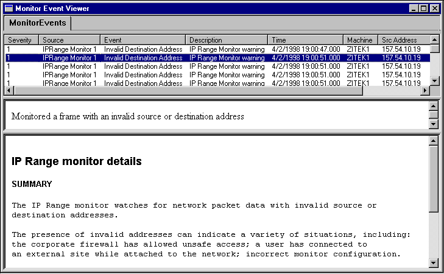

# Monitor Event Reference Pages

Event reference pages (ERPs) can be used connect your monitor to the Network Monitor UI. They can be used to alert end-users about detected conditions and problems, or they can be used to provide suggested fixes or explanatory data.

 

 

