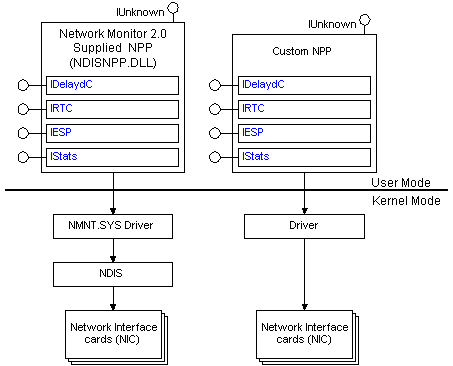

# Network Packet Providers

Network packet providers (NPPs) are Network Monitor system components that collect network traffic (frames) from the network and pass them on to the Network Monitor UI, and [*NPP applications*](n.md).

The following illustration shows two NPPs: the NDIS NPP provided by Network Monitor and a custom NPP.

The NDIS NPP provided by Network Monitor is Ndisnpp.dll. This NPP uses the Network Monitor system driver (Nmnt.sys) to get the frames collected from the network and several COM interfaces (referred to as the NPP interfaces) to pass the frames on to the Network Monitor UI, and NPP applications, where they can be displayed and analyzed.

Ndisnpp.dll connects to the [*NDIS*](n.md) layer to obtain its network traffic. (Custom NPPs can bypass the NDIS layer and communicate directly with the networking hardware.) Be aware that regardless of whether an NPP uses NDIS, NPPs can connect to any number of network cards and that all NPPs must support the same NPP interfaces.

Before an application can start to capture data, it must:

-   Select the network interface card (NIC) that will connect the NPP to the network.
-   Select the NPP interface that will be used to capture the network frames.
-   Use the selected interface to connect to the NIC.

For more information about how to enumerate and select a network interface card, see [Selecting a Network Interface Card](selecting-a-network-interface-card.md).

For more information about COM interfaces exposed by NPPs, see [Selecting an NPP Interface](selecting-an-npp-interface.md).

## Related topics

<dl> <dt>

[**IDelaydC**](idelaydc.md)
</dt> <dt>

[**IESP**](iesp.md)
</dt> <dt>

[**IRTC**](irtc.md)
</dt> <dt>

[**IStats**](istats.md)
</dt> </dl>

 

 

