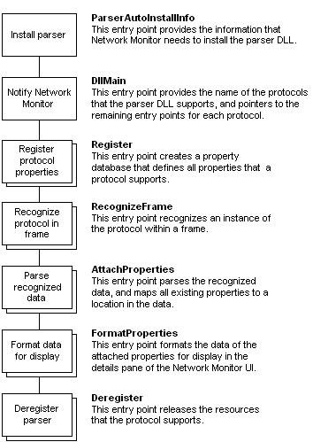

# Parser DLL Architecture

The architecture of the parser DLL must provide the features shown in the following illustration. Be aware that some features require the implementation of only one entry point. However, if your parser DLL supports multiple protocols, then the feature requires the implementation of multiple entry points.

| For information about                                                  | See                                                                    |
|------------------------------------------------------------------------|------------------------------------------------------------------------|
| How to implement parser DLL export functions.                          | [Writing a Protocol Parser](writing-a-protocol-parser.md)             |
| Specific functions and structures that parsers use — reference topics. | [Parser Functions and Structures](parser-functions-and-structures.md) |

 

 

 

