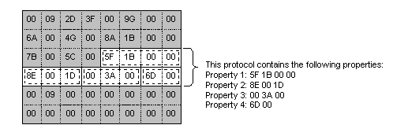

# Parser

A parser is the Network Monitor component that inspects data in a [*delayed capture*](d.md), and passes specific protocol information to the application that calls the parser. A parser is passive because it works only when Network Monitor or an [*expert*](e.md) call it.

Each parser identifies one protocol, and typically, a parser is implemented within its own parser DLL. However, a parser DLL can contain multiple parsers which means that one DLL can be used to detect more than one protocol.

The data passed to a parser is taken from a [*delayed capture*](d.md), and passed to the parser on a frame-by-frame basis. You cannot parse a real-time capture.

To parse the data in a frame, the parser must recognize the protocol instance, identify the properties that exist in the protocol instance, and attach a property definition to each property. Be aware that the frame contains only a stream of data. The frame does not contain data that indicates which protocols or protocol properties the data represents.

The following illustration shows a frame that contains an instance of a protocol.

If Network Monitor is going to display parsed data in the UI, the parser must format the data. However, some experts use the parser output programmatically, and do not display the output in the Network Monitor UI. Displayed data includes both parser-defined data, and the data in the capture. For example, the parser typically provides both a name for a property that is displayed, and the data in the capture that is associated with the property.

| For information about                                         | See                                                                    |
|---------------------------------------------------------------|------------------------------------------------------------------------|
| Which entry points must be implemented within the parser DLL. | [Parser DLL Architecture](parser-dll-architecture.md)                 |
| How to implement parser DLL export functions.                 | [Writing a Protocol Parser](writing-a-protocol-parser.md)             |
| Which functions and structures parsers use.                   | [Parser Functions and Structures](parser-functions-and-structures.md) |

 

 

 

