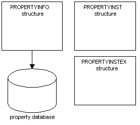

# Property Definition and Property Instance Structures

Network Monitor provides a [**PROPERTYINFO**](propertyinfo.md) structure to define the properties of a protocol, and a [**PROPERTYINST**](propertyinst.md), and [**PROPERTYINSTEX**](propertyinstex.md) structure to define an instance of a property.

The parser allocates and fills-in the [**PROPERTYINFO**](propertyinfo.md) structure for all the properties that a protocol supports. The parser passes the structure to Network Monitor where the structure is added to the protocol [*property database*](p.md). The information in the **PROPERTYINFO** structure is used when parsing an instance of a property, and when formatting the data that is displayed in the Network Monitor UI.

Network Monitor allocates the [**PROPERTYINST**](propertyinst.md) and [**PROPERTYINSTEX**](propertyinstex.md) structures when the parser attaches a property definition to an instance of a property.

The following procedure identifies the steps necessary to attach a property definition.

**To attach a property definition**

1.  Identify each property that exists in an instance of the protocol. When attaching a definition, Network Monitor passes the captured data to the parser. The data is passed on a protocol instance basis.
2.  Determine the location of the property in the protocol instance.
3.  Attach a property definition to the property location.

Network Monitor implements a [**PROPERTYINST**](propertyinst.md) structure when the parser uses the property data as it exists in the capture. Network Monitor implements a [**PROPERTYINSTEX**](propertyinstex.md) structure when the parser must modify the property data in the capture.

 

 

