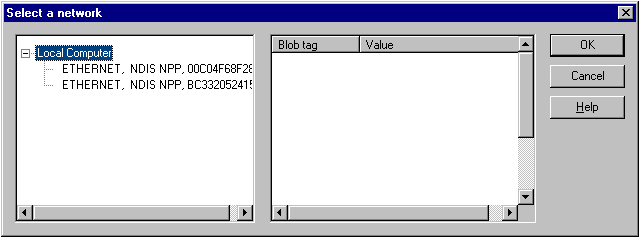

# Selecting a NIC from a Supplied NPP BLOB table

To select a network interface card (NIC) from a supplied NPP BLOB table, call the [**SelectNPPBlobFromTable**](selectnppblobfromtable.md) function. This function uses the Network Monitor UI to display the NICs represented in the BLOB table and returns the NPP BLOB that represents the selected NIC.

When you call the [**SelectNPPBlobFromTable**](selectnppblobfromtable.md) function, the **Select a network** dialog box appears. From it, you can view the details of the NPPs represented in the NPP BLOB table, select a specific NIC, and view the details of its associated NPP BLOB structure.

The following illustration shows the NICs represented in a supplied NPP BLOB table.

| For more information about                        | See                                                                                                      |
|---------------------------------------------------|----------------------------------------------------------------------------------------------------------|
| Selecting a NIC registered on the local computer. | [How to select a registered NIC](selecting-a-registered-nic.md)                                         |
| Retrieving an NPP BLOB table.                     | [How to select a NIC from a Returned NPP BLOB table](selecting-a-nic-from-a-returned-npp-blob-table.md) |

 

 

 

