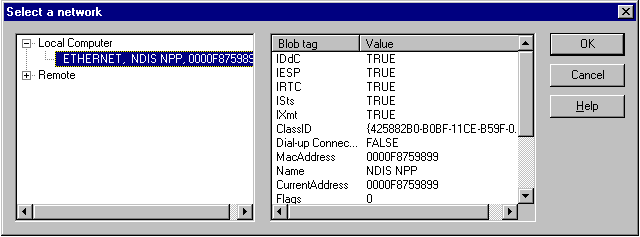

# Selecting a Registered NIC

To select one of the NICs registered on the local computer, call the [**GetNPPBlobFromUI**](getnppblobfromui.md) function. This function uses the Network Monitor UI to display the registered NICs and returns the NPP BLOB that represents the NIC you select. You can display all the NICs registered on the local computer or a smaller set of filtered NICs. To filter the displayed NICs, provide a [*filter BLOB*](f.md) when the call is made.

> [!Note]  
> When the [**GetNPPBlobFromUI**](getnppblobfromui.md) function is called, the [*NPP Finder*](n.md) communicates with the NPP DLLs to obtain the NPP BLOB structures that represent the registered NICs. For more information, and a procedure about how to use the Network Monitor UI directly, see the "Select a Network Dialog Box" topic in the Network Monitor online help.

 

When you call the [**GetNPPBlobFromUI**](getnppblobfromui.md) function, the **Select a network** dialog box appears. From it, you can view the details of the NPPs registered on the local computer. This information includes both local NPPs and remote NPPs. From the dialog box, you can select a specific NIC and view the details of its associated NPP BLOB structure.

The following illustration shows typical settings of an NDIS NPP supplied by Network Monitor.

The following table lists topics that describe each NIC selection method.

| For information about                                                                          | See                                                                                                  |
|------------------------------------------------------------------------------------------------|------------------------------------------------------------------------------------------------------|
| How to specify a filter that limits the NICs displayed in the **Select a network** dialog box. | [Specifying a Filter BLOB](specifying-a-filter-blob.md)                                             |
| How to select a NIC by calling the [**GetNPPBlobFromUI**](getnppblobfromui.md) function.      | [Selecting a NIC using GetNPPBlobFromUI](getnppblobfromui.md)                                       |
| How to select a NIC from a supplied NPP BLOB table.                                            | [Selecting a NIC from a Supplied NPP BLOB Table](selecting-a-nic-from-a-supplied-npp-blob-table.md) |

 

 

 

