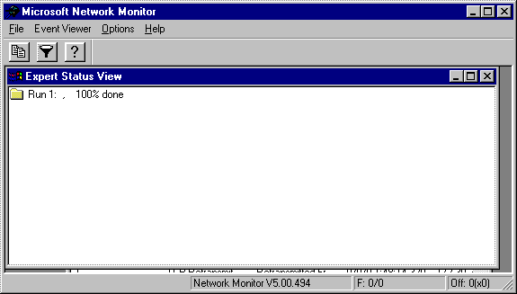
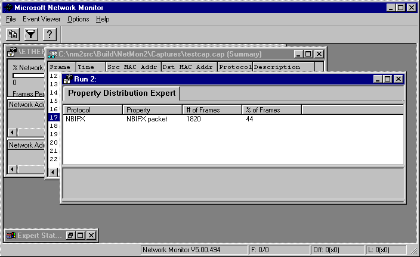

# Starting and Running Experts

Clicking **Run Experts** from the Experts window of the Network Monitor UI starts the experts selected for the capture file and calls the [**Run**](run.md) function. When started, the expert analyzes the capture file by using several expert frame functions.

The [**ExpertIndicateStatus**](expertindicatestatus.md) function provides status information from the expert. When you run an expert with Network Monitor, the Expert Status View window displays periodically updated status information (from 0 to 100 percent completion).

The expert is active until the data completes its pass though the capture file. When the pass is complete, an Event Viewer window appears. The information in this window depends on the type of expert that analyzed the data. The following illustration shows a Property Distribution Expert view, which summarizes the frame data that the expert analyzed.

A second report (not shown), summarizes the results of the Transmission Control Protocol (TCP) Retransmit expert.

You can also:

-   Create an entry for an event reference page (ERP) that advises the user of detected conditions or problems (as shown in the Analysis window).
-   Create entries for suggested fixes or explanatory data that provide additional information (as shown in the Resolution window).

After the expert completes its task, Network Monitor removes the expert from active memory. Experts should use the protected memory functions included in the Platform Software Development Kit (SDK); these functions clean up memory if the experts fail during run time.

 

 

