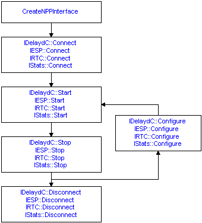
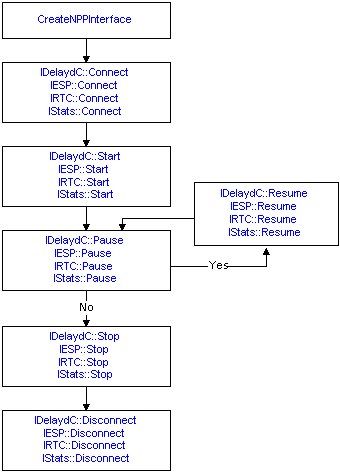

# The Capture Process

The capture process is the same for each of the four NPP interfaces. In each case, the process includes:

-   Obtaining the NPP interface object to use
-   Connecting to the network
-   Starting and then stopping the [*capture*](c.md)
-   Disconnecting from the network

> [!Note]  
> When you obtain the interface object that you want, ensure you call only the methods included in that interface. The following illustration shows each interface provides similar methods for capturing network data. An error is returned if you connect to the network with one interface and then try to run a capture using the methods from another interface.

 

The following illustrations show two different ways you could run a capture. The first illustration shows how to run one or more sequential captures, allowing you to create any number of independent captures.

As shown above, after you connect to the network you can start and stop a capture as many times as you wish, starting a new capture and generating new statistics every time you restart the capture. For example, for a delayed capture using the [**IDelaydC**](idelaydc.md) interface, a new [*capture file*](c.md) would be created each time you restarted the capture.

However, also be aware that every time you restart the capture process you must call the appropriate configure method to reconfigure the connection. For the initial call to start the capture, the connection is configured by the call to connect to the network.

The second illustration shows how you could run a single capture by pausing and restarting.

In this case, you can pause and restart a capture as many times as you want. With this approach, you can run a capture whose data (and its related statistics) are recorded as a single capture. For example, to perform a delayed capture using the [**IDelaydC**](idelaydc.md) interface, all the captured network information would be saved in a single [*capture file*](c.md).

## Related topics

<dl> <dt>

[**CreateNPPInterface**](createnppinterface.md)
</dt> <dt>

[**IDelaydC::Configure**](idelaydc-configure.md)
</dt> <dt>

[**IDelaydC::Connect**](idelaydc-connect.md)
</dt> <dt>

[**IDelaydC::Disconnect**](idelaydc-disconnect.md)
</dt> <dt>

[**IDelaydC::Pause**](idelaydc-pause.md)
</dt> <dt>

[**IDelaydC::Resume**](idelaydc-resume.md)
</dt> <dt>

[**IDelaydC::Start**](idelaydc-start.md)
</dt> <dt>

[**IDelaydC::Stop**](idelaydc-stop.md)
</dt> <dt>

[**IESP::Configure**](iesp-configure.md)
</dt> <dt>

[**IESP::Connect**](iesp-connect.md)
</dt> <dt>

[**IESP::Disconnect**](iesp-disconnect.md)
</dt> <dt>

[**IESP::Pause**](iesp-pause.md)
</dt> <dt>

[**IESP::Resume**](iesp-resume.md)
</dt> <dt>

[**IESP::Start**](iesp-start.md)
</dt> <dt>

[**IESP::Stop**](iesp-stop.md)
</dt> <dt>

[**IRTC::Configure**](irtc-configure.md)
</dt> <dt>

[**IRTC::Connect**](irtc-connect.md)
</dt> <dt>

[**IRTC::Disconnect**](irtc-disconnect.md)
</dt> <dt>

[**IRTC::Pause**](irtc-pause.md)
</dt> <dt>

[**IRTC::Resume**](irtc-resume.md)
</dt> <dt>

[**IRTC::Start**](irtc-start.md)
</dt> <dt>

[**IRTC::Stop**](irtc-stop.md)
</dt> <dt>

[**IStats::Configure**](istats-configure.md)
</dt> <dt>

[**IStats::Connect**](istats-connect.md)
</dt> <dt>

[**IStats::Disconnect**](istats-disconnect.md)
</dt> <dt>

[**IStats::Pause**](istats-pause.md)
</dt> <dt>

[**IStats::Resume**](istats-resume.md)
</dt> <dt>

[**IStats::Start**](istats-start.md)
</dt> <dt>

[**IStats::Stop**](istats-stop.md)
</dt> </dl>

 

 

