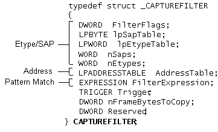

# The CAPTUREFILTER Structure

In Network Monitor, the [capture filter](capture-filters.md) is defined by the [**CAPTUREFILTER**](capturefilter.md) structure. The absence or combination of flags, values, and expressions determines which frames will be passed on or dropped by the Network Monitor driver. The following illustration shows the three areas of the capture filter analysis: Etype/SAP, address, and pattern match.

The following table lists the function of each capture filter element.

| Filter element                                       | Action                                                                                                                                                                                                       |
|------------------------------------------------------|--------------------------------------------------------------------------------------------------------------------------------------------------------------------------------------------------------------|
| [Etype/SAP](writing-etypesap-filter-portion.md)     | Evaluates Etype/SAP settings. The combination of flags determines which setting types or values are included or excluded.                                                                                    |
| [Address](writing-addresstable-filter-portion.md)   | Evaluates source and destination addresses and address pairs. Different combinations of flags determine which individual values or combinations of address pairs are included or excluded.                   |
| [Pattern Match](writing-the-patternmatch-filter.md) | Defines complex pattern matches within a frame. Flags are provided for different types and offsets. You can combine pattern matches with logical AND or OR operator statements.                              |
| [Clipping](clipping-a-frame.md)                     | Clips frames in a manner specified by various byte values. You can use only this element to clip all frames or use it with other capture filter elements; for example, to find and then clip a single frame. |
| [**Trigger**](trigger.md)                           | This capture filter element is obsolete. Triggers are no longer part of a capture filter; they are now contained in their own BLOB tags, which are specified separately.                                     |

 

A frame is evaluated against all three portions of the capture filter. Therefore, a successfully transmitted frame must pass each element. Be aware that the Network Monitor driver evaluates the absence of any of the three elements as **TRUE**. For example, the driver evaluates the absence of an Etype/SAP section as "ALL frames with the ANY Etype/SAP value are valid."

 

 

