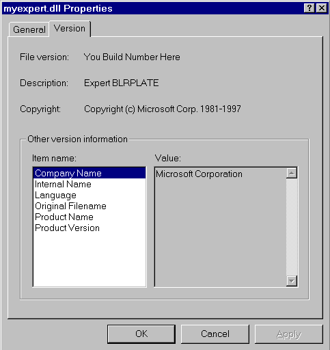

# Viewing Expert DLL Properties

Use the following procedure to view an expert DLL properties.

**To view DLL properties**

1.  Open Windows Explorer and go to the \\Experts subdirectory of Network Monitor (C:\\Program Files\\NetMon2\\Experts, for example).
2.  Select the desired DLL and right-click the file.
3.  Click **Properties** and **Version**. The following Myexpert.dll Properties status window example shows the DLL properties.
4.  Click the desired **Item name** to display information in the **Value** pane.
5.  Click **OK** to close the **Properties** dialog box.

 

 

