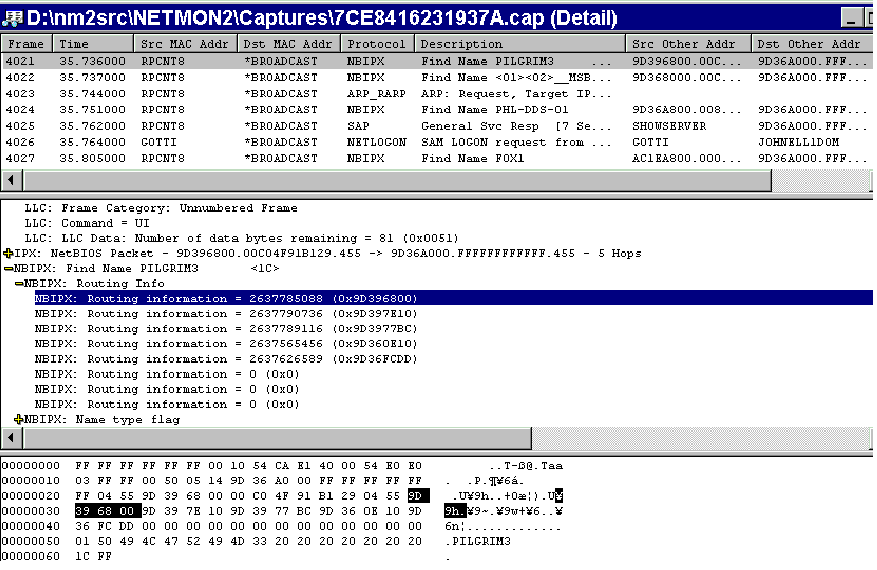

# Viewing Parsed Information

The Network Monitor frame viewer displays parsed data in three panes. The upper pane displays a summary of the frame that includes the identified protocol. The middle pane displays the formatted data properties that can be organized hierarchically as part of the parser display. The lower pane displays highlighted raw data that is selected from the middle pane.

You can specify how the information in the viewer is displayed when you develop your own parser. The following illustration shows how information can be displayed in the Network Monitor frame viewer.

> [!Note]  
> Parsers do not display frames. Parsers recognize fields in the information provided, and then notify Network Monitor to display the frame. Filtering is a higher level operation that allows filter queries to span parsers.

 

In your parser, use only functions that can run on Microsoft Win32 applications. Before attaching properties to the raw data, a parser must first register all possible properties with the Network Monitor kernel. The parser sends a message to the kernel to create a property database, and then fills the property database with every possible property for its protocol. Each property in the property database contains information such as a textual description, a data type and qualifier that are used to format the raw data, and a formatting routine that is used to display the data.

 

 

