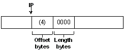

# Writing the PATTERNMATCH Filter

The pattern match filter notifies the driver to accept frames that have a specific pattern at a specific offset. You can specify a maximum of four detailed pattern matches, which can be combined in logical AND or OR statements for Network Monitor driver evaluation.

To implement pattern matches, use the following Network Monitor structures:

-   [**EXPRESSION**](expression.md)
-   [**ANDEXP**](andexp.md)
-   [**PATTERNMATCH**](patternmatch.md)

To evaluate an **OR** statement, combine two to four pattern matches an [**ANDEXP**](andexp.md) structure (PatternMatch1 \|\| PatternMatch2 \|\| PatternMatch3). To evaluate an AND statement, combine one to four **ANDEXP** structures and an [**EXPRESSION**](expression.md) structure (AndExp1 && AndExp2).

## Pattern Match Definitions

A single pattern match is defined by the [**PATTERNMATCH**](patternmatch.md) structure. An individual match can operate in one of two ways.

Normally, the driver will take the offset basis (which can be OFFSET\_BASIS\_RELATIVE\_TO\_FRAME, OFFSET\_BASIS\_RELATIVE\_TO\_EFFECTIVE\_PROTOCOL, OFFSET\_BASIS\_RELATIVE\_TO\_IPX, or OFFSET\_BASIS\_RELATIVE\_TO\_IP) and start counting there. The driver will count offset bytes from there and then match the data it finds with the first length bytes in **PatternToMatch**. If they are the same, and the PATTERN\_MATCH\_FLAGS\_NOT flag is not set, then this pattern passes. If they are different and the PATTERN\_MATCH\_FLAGS\_NOT has been set, the pattern passes. Otherwise this pattern fails.

Or:

If the PATTERN\_MATCH\_FLAGS\_PORT\_SPECIFIED flag is set, and the basis is set to OFFSET\_BASIS\_RELATIVE\_TO\_IPX or OFFSET\_BASIS\_RELATIVE\_TO\_IP, the comparison is more complex. First, the driver ensures that the offset basis protocol is there, then the driver verifies that the specified port matches the port in the frame. Finally the driver ensures that the **PatternToMatch** member matches as before, with the exception that the offset is from the end of IP or IPX. Note that if the basis is not one of these two, then the PATTERN\_MATCH\_FLAGS\_PORT\_SPECIFIED flag will be ignored, and the pattern will be evaluated as above.

To evaluate a single pattern match, an [**EXPRESSION**](expression.md) structure must have one **AndExp** member containing a single pattern match.

Building the pattern match filter involves creating [**PATTERNMATCH**](patternmatch.md) structures and logically combining them with [**EXPRESSION**](expression.md) and [**ANDEXP**](andexp.md) structures.

**To write a PATTERNMATCH filter**

1.  In the [**ANDEXP**](andexp.md) structure, populate the array with pattern matches.
2.  Populate the [**EXPRESSION**](expression.md) structure with an array of **AndExp** members.
3.  Do not exceed a total of four pattern matches for the capture filter.
4.  In the [**PATTERNMATCH**](patternmatch.md) structure, select a flag type.
5.  Select an offset basis.
6.  Enumerate a port value.
7.  Define offset value.
8.  Define the pattern length.
9.  Enumerate the pattern value.

## PATTERNMATCH Examples

This frame represents a standard offset.



The code fragment is implemented as:

``` syntax
Basis  ->   IP
Offset ->   4 (bytes)
Length ->   2 (bytes)
PatternToMatch[ ] = {x00, x00}
```

This frame depicts a port-specified offset (against IPX).


The example code is implemented as:

``` syntax
Port   ->   544
Basis  ->   IPX
Offset ->   2 (bytes)
Length ->   2 (bytes)
PatternToMatch[ ] = {x00, x00}
```

 

 


