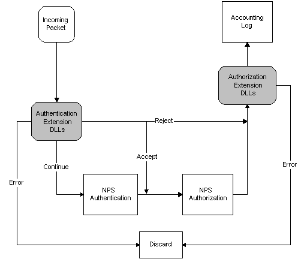

# About NPS Extensions

> [!Note]  
> Internet Authentication Service (IAS) was renamed Network Policy Server (NPS) starting with Windows Server 2008. The content of this topic applies to both IAS and NPS. Throughout the text, NPS is used to refer to all versions of the service, including the versions originally referred to as IAS.

 

This section describes how to implement DLLs to extend the functionality of NPS. It describes the interaction between NPS and the DLLs, and presents some design considerations regarding the DLLs.

NPS provides two extension points, one for authentication and the other for authorization. Authentication refers to verifying the identity of the user. Authorization refers to determining what services the network should provide to the user. The two extension points correspond to Authentication Extension DLLs and Authorization Extension DLLs. Each extension point can support multiple DLLs.

NPS provides both authentication and authorization services. Authentication Extension DLLs are called by NPS prior to the built-in NPS authentication and authorization. Authorization Extension DLLs are called after NPS authentication and authorization.

The following diagram illustrates the flow of packets through an NPS RADIUS server that is expanded using Extension DLLs.

If an Authentication Extension DLL returns ACCEPT, the packet skips the NPS authentication and goes directly to NPS authorization.

> [!Note]  
> When multiple Authentication Extension DLLs are present, the rest of the Extension DLLs might be skipped as well. See [Setting Up the Extension DLLs](https://msdn.microsoft.com/library/bb892024) for more information.

 

If an Authentication Extension DLL returns CONTINUE, the packet goes to NPS authentication, and then to NPS authorization.

> [!Note]  
> When multiple Authentication Extension DLLs are present, the rest of the Authentication Extension DLLs are invoked before NPS authentication.

 

The following topics describe the Extension DLLs in more detail:

-   [Setting Up the Extension DLLs](https://msdn.microsoft.com/library/bb892024)
-   [Invoking the Extension DLLs](https://msdn.microsoft.com/library/bb891988)
-   [User Identification Attributes](https://msdn.microsoft.com/library/bb892029)

 

 

