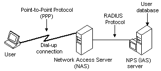

# RADIUS Authentication, Authorization, and Accounting

> [!Note]  
> Internet Authentication Service (IAS) was renamed Network Policy Server (NPS) starting with Windows Server 2008. The content of this topic applies to both IAS and NPS. Throughout the text, NPS is used to refer to all versions of the service, including the versions originally referred to as IAS.

 

NPS fully supports the Remote Authentication Dial-In User Service (RADIUS) protocol. The RADIUS protocol is the de facto standard for remote user authentication and it is documented in [RFC 2865](https://www.ietf.org/rfc/rfc2865.txt) and [RFC 2866](https://www.ietf.org/rfc/rfc2866.txt).

## RADIUS Authentication and Authorization

The following diagram shows an authenticating client ("User") connecting to a Network Access Server (NAS) over a dial-up connection, using the Point-to-Point Protocol (PPP). In order to authenticate the User, the NAS contacts a remote server running NPS. The NAS and the NPS server communicate using the RADIUS protocol.

A NAS operates as a client of a server or servers that support the RADIUS protocol. Servers that support the RADIUS protocol are generally referred to as the RADIUS servers. The RADIUS client, that is, the NAS, passes information about the User to designated RADIUS servers, and then acts on the response that the servers return. The request sent by the NAS to the RADIUS server in order to authenticate the User is generally called an "authentication request."

If a RADIUS server authenticates the User successfully, the RADIUS server returns configuration information to the NAS so that it can provide network service to the user. This configuration information is composed of "authorizations" and contains, among others, the type of service NAS may provide to the User (for example, PPP, or telnet).

While the RADIUS server is processing the authentication request, it can perform authorization functions such as verifying the user's telephone number and checking whether the user already has a session in progress. The RADIUS server can determine whether the user already has a session in progress by contacting a state server.

For more information on RADIUS authentication and authorization, see [RFC 2865](https://www.ietf.org/rfc/rfc2865.txt).

## RADIUS Accounting

The RADIUS server also collects a variety of information sent by the NAS that can be used for accounting and for reporting on network activity. The RADIUS client sends information to designated RADIUS servers when the User logs on and logs off. The RADIUS client may send additional usage information on a periodic basis while the session is in progress. The requests sent by the client to the server to record logon/logoff and usage information are generally called "accounting requests."

For more information on RADIUS accounting, see [RFC 2866](https://www.ietf.org/rfc/rfc2866.txt).

## RADIUS Proxy

A RADIUS server can act as a proxy client to other RADIUS servers. In these cases, the RADIUS server contacted by the NAS passes the authentication or accounting request to another RADIUS server that actually performs the authentication or the accounting task.

## Related topics

<dl> <dt>

[Internet Authentication Service and Network Policy Server](internet-authentication-service-vs-network-policy-server.md)
</dt> <dt>

[RADIUS Accounting Packets](/windows/desktop/Nps/ias-radius-accounting-packets)
</dt> <dt>

[Working with a State Server](/windows/desktop/Nps/ias-working-with-a-state-server)
</dt> </dl>

 

 