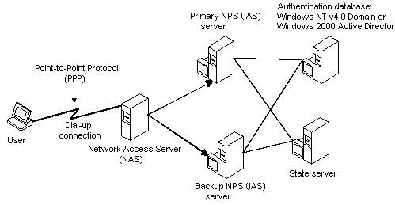

# Working With a State Server

> [!Note]  
> Internet Authentication Service (IAS) was renamed Network Policy Server (NPS) starting with Windows Server 2008. The content of this topic applies to both IAS and NPS. Throughout the text, NPS is used to refer to all versions of the service, including the versions originally referred to as IAS.

 

NPS performs authentication using a database that is configured at the NPS server site. This authentication database could be the user database for a Windows Domain or it could draw upon the user information obtained from the Windows Active Directory. The following diagram illustrates a typical configuration that shows how NPS interacts with authentication databases such as a Windows Domain user database or Active Directory. The diagram also shows how NPS could interact with a state server that is provided by a third party. The primary purpose of a state server is to limit the number of simultaneous logon sessions a single user can run.

There are two points of interaction between NPS and the state server. One interaction takes place when NPS receives an authentication request from the NAS. The state server provides information from its database to determine whether to accept or deny the request. The other interaction takes place when NPS receives accounting requests from the NAS. The state server uses the information form these accounting requests to update its database.

For more information on state servers see:

-   [State Server Design Considerations](/windows/desktop/Nps/ias-state-server-design-considerations)

## Related topics

<dl> <dt>

[Internet Authentication Service and Network Policy Server](internet-authentication-service-vs-network-policy-server.md)
</dt> <dt>

[RADIUS Authentication, Authorization, and Accounting](/windows/desktop/Nps/ias-radius-authentication-and-accounting)
</dt> <dt>

[Logging With Network Policy Server](/windows/desktop/Nps/ias-radius-accounting-packets)
</dt> </dl>

 

 