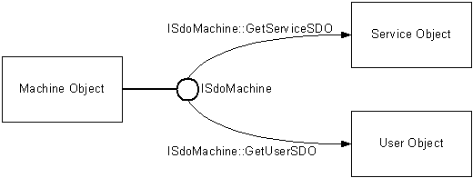
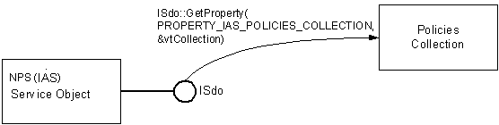

# Object Model Hierarchy

The objects in the SDO object model are arranged in a hierarchy. This means objects in SDO provide access to other objects in SDO.

Objects provide access to other objects in two ways. One way is for the object to expose an interface that provides methods to retrieve other objects. An example of this approach is the Machine object. The Machine object exposes the [**ISdoMachine**](https://msdn.microsoft.com/library/bb960655) interface. The [**ISdoMachine::GetServiceSDO**](https://msdn.microsoft.com/library/bb960661) method retrieves a Service object. The [**ISdoMachine::GetUserSDO**](https://msdn.microsoft.com/library/bb960662) method retrieves a User Object.

For more information, see [Obtaining Service and User SDOs](https://msdn.microsoft.com/library/bb960694).

The second way that objects provide access to other objects is that an object collection is represented as a property of the object that contains it. To retrieve an object collection, call [**ISdo::GetProperty**](https://msdn.microsoft.com/library/bb960671) on the property of an object that represents the collection. For example, to retrieve the Policies collection, call **ISdo::GetProperty** on the [**ISdo**](https://msdn.microsoft.com/library/bb960639) interface exposed by the NPS object.

> [!Note]  
> Internet Authentication Service (IAS) was renamed Network Policy Server (NPS) starting with Windows Server 2008.

 

For sample code that retrieves the Policies collection, see [Retrieving a Collection](https://msdn.microsoft.com/library/bb960708).

The [**NPS Server Data Object**](https://msdn.microsoft.com/library/bb960636) has the following properties that represent collections:

<dl> <dt>

Auditors
</dt> <dd>

The only auditor in the Auditors collection is the [**NT Event Log**](https://msdn.microsoft.com/library/bb960688).

</dd> <dt>

Policies
</dt> <dd>

Each [**policy object**](https://msdn.microsoft.com/library/bb960696) has a property that represents a collection of conditions.

</dd> <dt>

Profiles
</dt> <dd>

Each [**profile object**](https://msdn.microsoft.com/library/bb960697) in the Profiles collections has a property that represents an attributes collection. See [SDO Supported Attributes](https://msdn.microsoft.com/library/bb960711) for a list of the attributes supported by SDO.

</dd> <dt>

Protocols
</dt> <dd>

The protocols collection contains the RADIUS protocol object, which contains a clients collection that represents RADIUS clients. See [Adding a Client](https://msdn.microsoft.com/library/bb960607) for sample code that shows how to retrieve the client collection.

</dd> <dt>

Proxy Policies
</dt> <dd>

This collection contains Network Access Policies used for connection request processing.

</dd> <dt>

Proxy Profiles
</dt> <dd>

This collection contains profiles used for connection request processing.

</dd> <dt>

RADIUS Server Groups
</dt> <dd>

Each [**RADIUS server group**](https://msdn.microsoft.com/library/bb960701) in the RADIUS Server Groups collection has a property that represents the collection of servers in that server group.

</dd> <dt>

Request Handlers
</dt> <dd>

This collection contains the "Microsoft Realms Evaluator" collection. The "Microsoft NT SAM Authentication" and "Microsoft Accounting" settings are also available in this collection.

</dd> </dl>

## Related topics

<dl> <dt>

[SDO Objects and Properties](https://msdn.microsoft.com/library/bb960690)
</dt> <dt>

[SDO Supported Attributes](https://msdn.microsoft.com/library/bb960711)
</dt> </dl>

 

 

