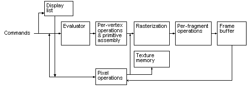

# Basic OpenGL Operation

The following diagram illustrates how OpenGL processes data. As shown, commands enter from the left and proceed through a processing pipeline. Some commands specify geometric objects to be drawn, and others control how the objects are handled during various processing stages.

The processing stages in basic OpenGL operation are as follows:

-   **Display list** Rather than having all commands proceed immediately through the pipeline, you can choose to accumulate some of them in a display list for processing later.
-   **Evaluator** The evaluator stage of processing provides an efficient way to approximate curve and surface geometry by evaluating polynomial commands of input values.
-   **Per-vertex operations and primitive assembly** OpenGL processes geometric primitivespoints, line segments, and polygonsall of which are described by vertices. Vertices are transformed and lit, and primitives are clipped to the viewport in preparation for rasterization.
-   **Rasterization** The rasterization stage produces a series of frame-buffer addresses and associated values using a two-dimensional description of a point, line segment, or polygon. Each fragment so produced is fed into the last stage, per-fragment operations.
-   **Per-fragment operations** These are the final operations performed on the data before it is stored as pixels in the framebuffer.

    Per-fragment operations include conditional updates to the framebuffer based on incoming and previously stored z values (for z buffering) and blending of incoming pixel colors with stored colors, as well as masking and other logical operations on pixel values.

Data can be input in the form of pixels rather than vertices. Data in the form of pixels, such as might describe an image for use in texture mapping, skips the first stage of processing described above and instead is processed as pixels, in the pixel operations stage. Following pixel operations, the pixel data is either:

-   Stored as texture memory, for use in the rasterization stage.
-   Rasterized, with the resulting fragments merged into the framebuffer just as if they were generated from geometric data.

 

 

