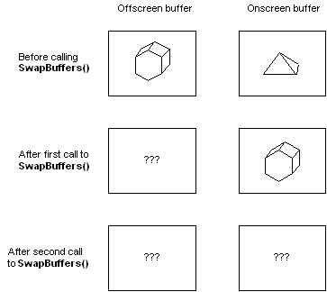

# Buffer Functions

To copy the contents of an off-screen buffer to an on-screen buffer, call [**SwapBuffers**](/windows/desktop/api/wingdi/nf-wingdi-swapbuffers). The **SwapBuffers** function takes a handle to a device context. The current pixel format for the specified device context must include a back buffer. By default, the back buffer is off-screen, and the front buffer is on-screen.

> [!Note]  
> The **SwapBuffers** function does not really swap the contents of the two buffers, but rather copies the contents of one buffer to another. The contents of the off-screen buffer are undefined after a call to **SwapBuffers**. Thus, the result of two consecutive calls to **SwapBuffers** is undefined.

 

The following illustration shows how the contents of the buffers are copied when calling **SwapBuffers**.

Several OpenGL core functions also manage buffers. The [**glDrawBuffer**](gldrawbuffer.md) function is the one most relevant to double buffering; it specifies the framebuffer or buffers that OpenGL draws into.

The following functions also affect buffers:

-   [**glReadBuffer**](glreadbuffer.md)
-   [**glReadPixels**](glreadpixels.md)
-   [**glCopyPixels**](glcopypixels.md)
-   [**glAccum**](glaccum.md)
-   [**glColorMask**](glcolormask.md)
-   [**glDepthMask**](gldepthmask.md)
-   [**glIndexMask**](glindexmask.md)
-   [**glStencilMask**](glstencilmask.md)
-   [**glClearAccum**](glclearaccum.md)
-   [**glClearColor**](glclearcolor.md)
-   [**glClearDepth**](glcleardepth.md)
-   [**glClearIndex**](glclearindex.md)
-   [**glClearStencil**](glclearstencil.md)

 

 

