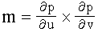
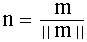

# glEvalCoord2fv function

The **glEvalCoord2fv** function evaluates enabled two-dimensional maps.

## Syntax


```C++
void WINAPI glEvalCoord2fv(
   const GLfloat *u
);
```


## Parameters

<dl> <dt>

*u* 
</dt> <dd>

A pointer to an array containing the domain coordinate *u*.

</dd> </dl>

## Return value

This function does not return a value.

## Remarks

The **glEvalCoord2fv** function evaluates enabled two-dimensional maps using two domain values, *u* and *v*. Define maps with [**glMap1**](glmap1.md). Enable or disable them with [**glEnable**](glenable.md) and [**glDisable**](gldisable.md).

When one of the **glEvalCoord** functions is issued, all currently enabled maps of the indicated dimension are evaluated. Then, for each enabled map, it is as if the corresponding OpenGL function were issued with the computed value. That is, if GL\_MAP1\_INDEX or GL\_MAP2\_INDEX is enabled, a [**glIndex**](glindex-functions.md) function is simulated. If GL\_MAP1\_COLOR\_4 or GL\_MAP2\_COLOR\_4 is enabled, a **glcolor** function is simulated. If GL\_MAP1\_NORMAL or GL\_MAP2\_NORMAL is enabled, a normal vector is produced, and if any of GL\_MAP1\_TEXTURE\_COORD\_1, GL\_MAP1\_TEXTURE\_COORD\_2, GL\_MAP1\_TEXTURE\_COORD\_3, GL\_MAP1\_TEXTURE\_COORD\_4, GL\_MAP2\_TEXTURE\_COORD\_1, GL\_MAP2\_TEXTURE\_COORD\_2, GL\_MAP2\_TEXTURE\_COORD\_3, and GL\_MAP2\_TEXTURE\_COORD\_4 is enabled, then an appropriate [**glTexCoord**](gltexcoord-functions.md) function is simulated.

OpenGL uses evaluated values instead of current values for those evaluations that are enabled, and current values otherwise, for color, color index, normal, and texture coordinates. However, the evaluated values do not update the current values. Thus, if [**glVertex**](glvertex-functions.md) functions are interspersed with **glEvalCoord** functions, the color, normal, and texture coordinates associated with the **glVertex** functions are not affected by the values generated by the **glEvalCoord** functions, but only by the most recent [**glColor**](glcolor-functions.md), [**glIndex**](glindex-functions.md), [**glNormal**](glnormal-functions.md), and [**glTexCoord**](gltexcoord-functions.md) functions.

If automatic normal generation is enabled, **glEvalCoord2fv** calls [**glEnable**](glenable.md) with argument GL\_AUTO\_NORMAL to generate surface normals analytically, regardless of the contents or enabling of the GL\_MAP2\_NORMAL map. Let



The generated normal **n** is



The following functions retrieve information related to the **glEvalCoord2fv** function:

[**glIsEnabled**](glisenabled.md) with argument GL\_MAP1\_VERTEX\_3

[**glIsEnabled**](glisenabled.md) with argument GL\_MAP1\_VERTEX\_4

[**glIsEnabled**](glisenabled.md) with argument GL\_MAP1\_INDEX

[**glIsEnabled**](glisenabled.md) with argument GL\_MAP1\_COLOR\_4

[**glIsEnabled**](glisenabled.md) with argument GL\_MAP1\_NORMAL

[**glIsEnabled**](glisenabled.md) with argument GL\_MAP1\_TEXTURE\_COORD\_1

[**glIsEnabled**](glisenabled.md) with argument GL\_MAP1\_TEXTURE\_COORD\_2

[**glIsEnabled**](glisenabled.md) with argument GL\_MAP1\_TEXTURE\_COORD\_3

[**glIsEnabled**](glisenabled.md) with argument GL\_MAP1\_TEXTURE\_COORD\_4

[**glIsEnabled**](glisenabled.md) with argument GL\_MAP2\_VERTEX\_3

[**glIsEnabled**](glisenabled.md) with argument GL\_MAP2\_VERTEX\_4

[**glIsEnabled**](glisenabled.md) with argument GL\_MAP2\_INDEX

[**glIsEnabled**](glisenabled.md) with argument GL\_MAP2\_COLOR\_4

[**glIsEnabled**](glisenabled.md) with argument GL\_MAP2\_NORMAL

[**glIsEnabled**](glisenabled.md) with argument GL\_MAP2\_TEXTURE\_COORD\_1

[**glIsEnabled**](glisenabled.md) with argument GL\_MAP2\_TEXTURE\_COORD\_2

[**glIsEnabled**](glisenabled.md) with argument GL\_MAP2\_TEXTURE\_COORD\_3

[**glIsEnabled**](glisenabled.md) with argument GL\_MAP2\_TEXTURE\_COORD\_4

[**glIsEnabled**](glisenabled.md) with argument GL\_AUTO\_NORMAL

## Requirements


| Requirement | Value |
|-------------------------------------|-----------------------------------------------------------------------------------------|
| Minimum supported client<br/> | Windows 2000 Professional \[desktop apps only\]<br/>                              |
| Minimum supported server<br/> | Windows 2000 Server \[desktop apps only\]<br/>                                    |
| Header<br/>                   | <dl> <dt>Gl.h</dt> </dl>         |
| Library<br/>                  | <dl> <dt>Opengl32.lib</dt> </dl> |
| DLL<br/>                      | <dl> <dt>Opengl32.dll</dt> </dl> |


## See also

<dl> <dt>

[**glBegin**](glbegin.md)
</dt> <dt>

[**glColor**](glcolor-functions.md)
</dt> <dt>

[**glDisable**](gldisable.md)
</dt> <dt>

[**glEnable**](glenable.md)
</dt> <dt>

[**glEnd**](glend.md)
</dt> <dt>

[**glEvalMesh**](glevalmesh-functions.md)
</dt> <dt>

[**glEvalPoint**](glevalpoint.md)
</dt> <dt>

[**glGetMap**](glgetmap.md)
</dt> <dt>

[**glIndex**](glindex-functions.md)
</dt> <dt>

[**glIsEnabled**](glisenabled.md)
</dt> <dt>

[**glMap1**](glmap1.md)
</dt> <dt>

[**glMap2**](glmap2.md)
</dt> <dt>

[**glMapGrid**](glmapgrid-functions.md)
</dt> <dt>

[**glNormal**](glnormal-functions.md)
</dt> <dt>

[**glTexCoord**](gltexcoord-functions.md)
</dt> <dt>

[**glVertex**](glvertex-functions.md)
</dt> </dl>

 

 


