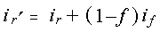

# glFogi function

The **glFogi** function specifies fog parameters.

## Syntax


```C++
void WINAPI glFogi(
   GLenum pname,
   GLint  param
);
```


## Parameters

<dl> <dt>

*pname* 
</dt> <dd>

Specifies a single-valued fog parameter.

Accepts one of the following values.


| Value                                                                                                                                                             | Meaning                                                                                                                                                                                                                                                                                                                                                   |
|-------------------------------------------------------------------------------------------------------------------------------------------------------------------|-----------------------------------------------------------------------------------------------------------------------------------------------------------------------------------------------------------------------------------------------------------------------------------------------------------------------------------------------------------|
| <span id="GL_FOG_MODE"></span><span id="gl_fog_mode"></span><dl> <dt>**GL\_FOG\_MODE**</dt> </dl>          | The *params* parameter is a single integer value that specifies the equation to be used to compute the fog blend factor, *f*. Three symbolic constants are accepted: GL\_LINEAR, GL\_EXP, and GL\_EXP2. The equations corresponding to these symbolic constants are defined in the following Remarks section. The default fog mode is GL\_EXP.<br/> |
| <span id="GL_FOG_DENSITY"></span><span id="gl_fog_density"></span><dl> <dt>**GL\_FOG\_DENSITY**</dt> </dl> | The *params* parameter is a single integer value that specifies *density*, the fog density used in both exponential fog equations. Only nonnegative densities are accepted. The default fog density is 1.0.<br/>                                                                                                                                    |
| <span id="GL_FOG_START"></span><span id="gl_fog_start"></span><dl> <dt>**GL\_FOG\_START**</dt> </dl>       | The *params* parameter is a single integer value that specifies *start*, the near distance used in the linear fog equation. The default near distance is 0.0.<br/>                                                                                                                                                                                  |
| <span id="GL_FOG_END"></span><span id="gl_fog_end"></span><dl> <dt>**GL\_FOG\_END**</dt> </dl>             | The *params* parameter is a single integer value that specifies *end*, the far distance used in the linear fog equation. The default far distance is 1.0.<br/>                                                                                                                                                                                      |
| <span id="GL_FOG_INDEX"></span><span id="gl_fog_index"></span><dl> <dt>**GL\_FOG\_INDEX**</dt> </dl>       | The *params* parameter is a single integer value that specifies *i*<sub>f</sub> , the fog color index. The default fog index is 0.0.<br/>                                                                                                                                                                                                           |


 

</dd> <dt>

*param* 
</dt> <dd>

Specifies the value that *pname* will be set to.

</dd> </dl>

## Return value

This function does not return a value.

## Error codes

The following error codes can be retrieved by the [**glGetError**](glgeterror.md) function.


| Name                                                                                                  | Meaning                                                                                                                               |
|-------------------------------------------------------------------------------------------------------|---------------------------------------------------------------------------------------------------------------------------------------|
| <dl> <dt>**GL\_INVALID\_ENUM**</dt> </dl>      | *pname* was not an accepted value.<br/>                                                                                         |
| <dl> <dt>**GL\_INVALID\_OPERATION**</dt> </dl> | The function was called between a call to [**glBegin**](glbegin.md) and the corresponding call to [**glEnd**](glend.md).<br/> |


## Remarks

You enable and disable fog with [**glEnable**](glenable.md) and [**glDisable**](gldisable.md), using the argument GL\_FOG. While enabled, fog affects rasterized geometry, bitmaps, and pixel blocks, but not buffer-clear operations.

The **glFogi** function assigns the value or values in *params* to the fog parameter specified by *pname*.

Fog blends a fog color with each rasterized pixel fragment's posttexturing color using a blending factor *f*. Factor *f* is computed in one of three ways, depending on the fog mode. Let *z* be the distance in eye coordinates from the origin to the fragment being fogged. The equation for GL\_LINEAR fog is:


The equation for GL\_EXP fog is:


The equation for GL\_EXP2 fog is:


Regardless of the fog mode, *f* is clamped to the range \[0,1\] after it is computed. Then, if OpenGL is in RGBA color mode, the fragment's color *C*<sub>r</sub> is replaced by


In color-index mode, the fragment's color index *i*<sub>r</sub> is replaced by



The following functions retrieve information related to the **glFog** functions:

[**glGet**](glgetbooleanv--glgetdoublev--glgetfloatv--glgetintegerv.md) with argument GL\_FOG\_COLOR

**glGet** with argument GL\_FOG\_INDEX

**glGet** with argument GL\_FOG\_DENSITY

**glGet** with argument GL\_FOG\_START

**glGet** with argument GL\_FOG\_END

**glGet** with argument GL\_FOG\_MODE

[**glIsEnabled**](glisenabled.md) with argument GL\_FOG

## Requirements


| Requirement | Value |
|-------------------------------------|-----------------------------------------------------------------------------------------|
| Minimum supported client<br/> | Windows 2000 Professional \[desktop apps only\]<br/>                              |
| Minimum supported server<br/> | Windows 2000 Server \[desktop apps only\]<br/>                                    |
| Header<br/>                   | <dl> <dt>Gl.h</dt> </dl>         |
| Library<br/>                  | <dl> <dt>Opengl32.lib</dt> </dl> |
| DLL<br/>                      | <dl> <dt>Opengl32.dll</dt> </dl> |


## See also

<dl> <dt>

[**glBegin**](glbegin.md)
</dt> <dt>

[**glDisable**](gldisable.md)
</dt> <dt>

[**glEnable**](glenable.md)
</dt> <dt>

[**glEnd**](glend.md)
</dt> <dt>

[**glGet**](glgetbooleanv--glgetdoublev--glgetfloatv--glgetintegerv.md)
</dt> <dt>

[**glIsEnabled**](glisenabled.md)
</dt> </dl>

 

 


