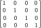

# glLoadIdentity function

The **glLoadIdentity** function replaces the current matrix with the identity matrix.

## Syntax


```C++
void WINAPI glLoadIdentity(void);
```


## Parameters

This function has no parameters.

## Return value

This function does not return a value.

## Error codes

The following error code can be retrieved by the [**glGetError**](glgeterror.md) function.


| Name                                                                                                  | Meaning                                                                                                                               |
|-------------------------------------------------------------------------------------------------------|---------------------------------------------------------------------------------------------------------------------------------------|
| <dl> <dt>**GL\_INVALID\_OPERATION**</dt> </dl> | The function was called between a call to [**glBegin**](glbegin.md) and the corresponding call to [**glEnd**](glend.md).<br/> |


## Remarks

The **glLoadIdentity** function replaces the current matrix with the identity matrix. It is semantically equivalent to calling [**glLoadMatrix**](glloadmatrix.md) with the following identity matrix.



However, in some cases, it is more efficient.

The following functions retrieve information related to **glLoadIdentity**:

[**glGet**](glgetbooleanv--glgetdoublev--glgetfloatv--glgetintegerv.md) with argument GL\_MATRIX\_MODE

**glGet** with argument GL\_MODELVIEW\_MATRIX

**glGet** with argument GL\_PROJECTION\_MATRIX

**glGet** with argument GL\_TEXTURE\_MATRIX

## Requirements


| Requirement | Value |
|-------------------------------------|-----------------------------------------------------------------------------------------|
| Minimum supported client<br/> | Windows 2000 Professional \[desktop apps only\]<br/>                              |
| Minimum supported server<br/> | Windows 2000 Server \[desktop apps only\]<br/>                                    |
| Header<br/>                   | <dl> <dt>Gl.h</dt> </dl>         |
| Library<br/>                  | <dl> <dt>Opengl32.lib</dt> </dl> |
| DLL<br/>                      | <dl> <dt>Opengl32.dll</dt> </dl> |


## See also

<dl> <dt>

[**glBegin**](glbegin.md)
</dt> <dt>

[**glEnd**](glend.md)
</dt> <dt>

[**glLoadMatrix**](glloadmatrix.md)
</dt> <dt>

[**glMatrixMode**](glmatrixmode.md)
</dt> <dt>

[**glMultMatrix**](glmultmatrix.md)
</dt> <dt>

[**glPushMatrix**](glpushmatrix.md)
</dt> </dl>

 

 


