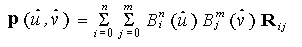
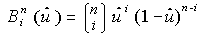
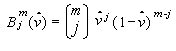
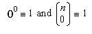
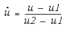
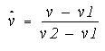

# glMap2d function

The **glMap2d** and [**glMap2f**](glmap2f.md) functions define a two-dimensional evaluator.

## Syntax


```C++
void WINAPI glMap2d(
         GLenum   target,
         GLdouble u1,
         GLdouble u2,
         GLint    ustride,
         GLint    uorder,
         GLdouble v1,
         GLdouble v2,
         GLint    vstride,
         GLint    vorder,
   const GLdouble *points
);
```


## Parameters

<dl> <dt>

*target* 
</dt> <dd>

The kind of values that are generated by the evaluator. The following symbolic constants are accepted.


| Value                                                                                                                                                                                          | Meaning                                                                                                                                                                                                                                                                                                                               |
|------------------------------------------------------------------------------------------------------------------------------------------------------------------------------------------------|---------------------------------------------------------------------------------------------------------------------------------------------------------------------------------------------------------------------------------------------------------------------------------------------------------------------------------------|
| <span id="GL_MAP2_VERTEX_3"></span><span id="gl_map2_vertex_3"></span><dl> <dt>**GL\_MAP2\_VERTEX\_3**</dt> </dl>                       | Each control point is three floating-point values representing *x, y,* and *z*. Internal [**glVertex3**](glvertex-functions.md) commands are generated when the map is evaluated.<br/>                                                                                                                                         |
| <span id="GL_MAP2_VERTEX_4"></span><span id="gl_map2_vertex_4"></span><dl> <dt>**GL\_MAP2\_VERTEX\_4**</dt> </dl>                       | Each control point is four floating-point values representing *x, y, z,* and *w*. Internal [**glVertex4**](glvertex-functions.md) commands are generated when the map is evaluated.<br/>                                                                                                                                       |
| <span id="GL_MAP2_INDEX"></span><span id="gl_map2_index"></span><dl> <dt>**GL\_MAP2\_INDEX**</dt> </dl>                                 | Each control point is a single floating-point value representing a color index. Internal [**glIndex**](glindex-functions.md) commands are generated when the map is evaluated. The current index is not updated with the value of these **glIndex** commands, however.<br/>                                                    |
| <span id="GL_MAP2_COLOR_4"></span><span id="gl_map2_color_4"></span><dl> <dt>**GL\_MAP2\_COLOR\_4**</dt> </dl>                          | Each control point is four floating-point values representing red, green, blue, and alpha. Internal [**glColor4**](glcolor-functions.md) commands are generated when the map is evaluated. The current color is not updated with the value of these **glColor4** commands, however.<br/>                                       |
| <span id="GL_MAP2_NORMAL"></span><span id="gl_map2_normal"></span><dl> <dt>**GL\_MAP2\_NORMAL**</dt> </dl>                              | Each control point is three floating-point values representing the *x, y,* and *z* components of a normal vector. Internal [**glNormal**](glnormal-functions.md) commands are generated when the map is evaluated. The current normal is not updated with the value of these **glNormal** commands, however.<br/>              |
| <span id="GL_MAP2_TEXTURE_COORD_1"></span><span id="gl_map2_texture_coord_1"></span><dl> <dt>**GL\_MAP2\_TEXTURE\_COORD\_1**</dt> </dl> | Each control point is a single floating-point value representing the *s* texture coordinate. Internal [**glTexCoord1**](gltexcoord-functions.md) commands are generated when the map is evaluated. The current texture coordinates are not updated with the value of these **glTexCoord** commands, however.<br/>              |
| <span id="GL_MAP2_TEXTURE_COORD_2"></span><span id="gl_map2_texture_coord_2"></span><dl> <dt>**GL\_MAP2\_TEXTURE\_COORD\_2**</dt> </dl> | Each control point is two floating-point values representing the *s* and *t* texture coordinates. Internal [**glTexCoord2**](gltexcoord-functions.md) commands are generated when the map is evaluated. The current texture coordinates are not updated with the value of these **glTexCoord** commands, however.<br/>         |
| <span id="GL_MAP2_TEXTURE_COORD_3"></span><span id="gl_map2_texture_coord_3"></span><dl> <dt>**GL\_MAP2\_TEXTURE\_COORD\_3**</dt> </dl> | Each control point is three floating-point values representing the *s, t,* and *r* texture coordinates. Internal [**glTexCoord3**](gltexcoord-functions.md) commands are generated when the map is evaluated. The current texture coordinates are not updated with the value of these **glTexCoord** commands, however.<br/>   |
| <span id="GL_MAP2_TEXTURE_COORD_4"></span><span id="gl_map2_texture_coord_4"></span><dl> <dt>**GL\_MAP2\_TEXTURE\_COORD\_4**</dt> </dl> | Each control point is four floating-point values representing the *s, t, r,* and *q* texture coordinates. Internal [**glTexCoord4**](gltexcoord-functions.md) commands are generated when the map is evaluated. The current texture coordinates are not updated with the value of these **glTexCoord** commands, however.<br/> |


 

</dd> <dt>

*u1* 
</dt> <dd>

A linear mapping of *u*, as presented to [**glEvalCoord2**](glevalcoord-functions.md), to *u*^, one of the two variables that is evaluated by the equations specified by this command.

</dd> <dt>

*u2* 
</dt> <dd>

A linear mapping of *u*, as presented to [**glEvalCoord2**](glevalcoord-functions.md), to *u*^, one of the two variables that is evaluated by the equations specified by this command.

</dd> <dt>

*ustride* 
</dt> <dd>

The number of floats or doubles between the beginning of control point **R** *ij* and the beginning of control point **R** <sub>(i\ +1\ )\ j</sub>, where *i* and *j* are the *u* and *v* control point indexes, respectively. This allows control points to be embedded in arbitrary data structures. The only constraint is that the values for a particular control point must occupy contiguous memory locations.

</dd> <dt>

*uorder* 
</dt> <dd>

The dimension of the control point array in the *u*-axis. Must be positive.

</dd> <dt>

*v1* 
</dt> <dd>

A linear mapping of *v*, as presented to [**glEvalCoord2**](glevalcoord-functions.md), to *v*^, one of the two variables that is evaluated by the equations specified by this command.

</dd> <dt>

*v2* 
</dt> <dd>

A linear mapping of *v*, as presented to [**glEvalCoord2**](glevalcoord-functions.md), to *v*^, one of the two variables that is evaluated by the equations specified by this command.

</dd> <dt>

*vstride* 
</dt> <dd>

The number of floats or doubles between the beginning of control point **R** *ij* and the beginning of control point **R** <sub>i(j\ +1\ )</sub>, where *i* and *j* are the *u* and *v* control point indexes, respectively. This allows control points to be embedded in arbitrary data structures. The only constraint is that the values for a particular control point must occupy contiguous memory locations.

</dd> <dt>

*vorder* 
</dt> <dd>

The dimension of the control point array in the *v*-axis. Must be positive.

</dd> <dt>

*points* 
</dt> <dd>

A pointer to the array of control points.

</dd> </dl>

## Return value

This function does not return a value.

## Error codes

The following error codes can be retrieved by the [**glGetError**](glgeterror.md) function.


| Name                                                                                                  | Meaning                                                                                                                               |
|-------------------------------------------------------------------------------------------------------|---------------------------------------------------------------------------------------------------------------------------------------|
| <dl> <dt>**GL\_INVALID\_ENUM**</dt> </dl>      | *target* was not an accepted value.<br/>                                                                                        |
| <dl> <dt>**GL\_INVALID\_VALUE**</dt> </dl>     | *u1* was equal to *u2*, or *v1* was equal to *v2*.<br/>                                                                         |
| <dl> <dt>**GL\_INVALID\_VALUE**</dt> </dl>     | Either *ustride* or *vstride* was less than the number of values in a control point.<br/>                                       |
| <dl> <dt>**GL\_INVALID\_VALUE**</dt> </dl>     | Either *uorder* or *vorder* was less than one or GL\_MAX\_EVAL\_ORDER.<br/>                                                     |
| <dl> <dt>**GL\_INVALID\_OPERATION**</dt> </dl> | The function was called between a call to [**glBegin**](glbegin.md) and the corresponding call to [**glEnd**](glend.md).<br/> |


## Remarks

Evaluators provide a way to use polynomial or rational polynomial mapping to produce vertices, normals, texture coordinates, and colors. The values produced by an evaluator are sent on to further stages of OpenGL processing just as if they had been presented using [**glVertex**](glvertex-functions.md), [**glNormal**](glnormal-functions.md), [**glTexCoord**](gltexcoord-functions.md), and [**glColor**](glcolor-functions.md) commands, except that the generated values do not update the current normal, texture coordinates, or color.

All polynomial or rational polynomial splines of any degree (up to the maximum degree supported by the OpenGL implementation) can be described using evaluators. These include almost all surfaces used in computer graphics, including B-spline surfaces, NURBS surfaces, Bezier surfaces, and so on.

Evaluators define surfaces based on bivariate Bernstein polynomials. Define **p** (*u*^,*v*^) as



where **R** *ij* is a control point, () is the *i*th Bernstein polynomial of degree

*n* (*uorder* = *n* + 1)



and () is the *j*th Bernstein polynomial of degree *m* (*vorder* = *m* + 1)



Recall that



The **glMap2** function is used to define the basis and to specify what kind of values are produced. Once defined, a map can be enabled and disabled by calling [**glEnable**](glenable.md) and **glDisable** with the map name, one of the nine predefined values for *target*, described above. When [**glEvalCoord2**](glevalcoord-functions.md) presents values *u* and *v*, the bivariate Bernstein polynomials are evaluated using *u*^ and *v*^, where



and



The *target* parameter is a symbolic constant that indicates what kind of control points are provided in *points*, and what output is generated when the map is evaluated.

The *ustride*, *uorder*, *vstride*, *vorder*, and *points* parameters define the array addressing for accessing the control points. The *points* parameter is the location of the first control point, which occupies one, two, three, or four contiguous memory locations, depending on which map is being defined. There are *uorder* x *vorder* control points in the array. The *ustride* parameter tells how many float or double locations are skipped to advance the internal memory pointer from control point **R** *ij* to control point **R** <sub>(\ i+1\ )j</sub>. The *vstride* parameter tells how many float or double locations are skipped to advance the internal memory pointer from control point **R** *ij* to control point **R**<sub>i(j\ +1\ )</sub>.

As is the case with all OpenGL commands that accept pointers to data, it is as if the contents of *points* were copied by **glMap2** before it returned. Changes to the contents of *points* have no effect after **glMap2** is called.

The following functions retrieve information related to **glMap2**:

[**glGet**](glgetbooleanv--glgetdoublev--glgetfloatv--glgetintegerv.md) with argument GL\_MAX\_EVAL\_ORDER

[**glGetMap**](glgetmap.md)

[**glIsEnabled**](glisenabled.md) with argument GL\_MAP2\_VERTEX\_3

**glIsEnabled** with argument GL\_MAP2\_VERTEX\_4

**glIsEnabled** with argument GL\_MAP2\_INDEX

**glIsEnabled** with argument GL\_MAP2\_COLOR\_4

**glIsEnabled** with argument GL\_MAP2\_NORMAL

**glIsEnabled** with argument GL\_MAP2\_TEXTURE\_COORD\_1

**glIsEnabled** with argument GL\_MAP2\_TEXTURE\_COORD\_2

**glIsEnabled** with argument GL\_MAP2\_TEXTURE\_COORD\_3

**glIsEnabled** with argument GL\_MAP2\_TEXTURE\_COORD\_4

## Requirements


| Requirement | Value |
|-------------------------------------|-----------------------------------------------------------------------------------------|
| Minimum supported client<br/> | Windows 2000 Professional \[desktop apps only\]<br/>                              |
| Minimum supported server<br/> | Windows 2000 Server \[desktop apps only\]<br/>                                    |
| Header<br/>                   | <dl> <dt>Gl.h</dt> </dl>         |
| Library<br/>                  | <dl> <dt>Opengl32.lib</dt> </dl> |
| DLL<br/>                      | <dl> <dt>Opengl32.dll</dt> </dl> |


## See also

<dl> <dt>

[**glBegin**](glbegin.md)
</dt> <dt>

[**glColor**](glcolor-functions.md)
</dt> <dt>

[**glEnable**](glenable.md)
</dt> <dt>

[**glEnd**](glend.md)
</dt> <dt>

[**glEvalCoord**](glevalcoord-functions.md)
</dt> <dt>

[**glEvalMesh**](glevalmesh-functions.md)
</dt> <dt>

[**glEvalPoint**](glevalpoint.md)
</dt> <dt>

[**glMap1**](glmap1.md)
</dt> <dt>

[**glMapGrid**](glmapgrid-functions.md)
</dt> <dt>

[**glNormal**](glnormal-functions.md)
</dt> <dt>

[**glTexCoord**](gltexcoord-functions.md)
</dt> <dt>

[**glVertex**](glvertex-functions.md)
</dt> </dl>

 

 


