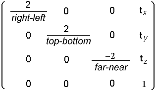
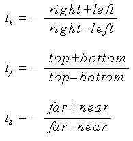

# glOrtho function

The **glOrtho** function multiplies the current matrix by an orthographic matrix.

## Syntax


```C++
void WINAPI glOrtho(
   GLdouble left,
   GLdouble right,
   GLdouble bottom,
   GLdouble top,
   GLdouble zNear,
   GLdouble zFar
);
```


## Parameters

<dl> <dt>

*left* 
</dt> <dd>

The coordinates for the left vertical clipping plane.

</dd> <dt>

*right* 
</dt> <dd>

The coordinates for theright vertical clipping plane.

</dd> <dt>

*bottom* 
</dt> <dd>

The coordinates for the bottom horizontal clipping plane.

</dd> <dt>

*top* 
</dt> <dd>

The coordinates for the top horizontal clipping plans.

</dd> <dt>

*zNear* 
</dt> <dd>

The distances to the nearer depth clipping plane. This distance is negative if the plane is to be behind the viewer.

</dd> <dt>

*zFar* 
</dt> <dd>

The distances to the farther depth clipping plane. This distance is negative if the plane is to be behind the viewer.

</dd> </dl>

## Return value

This function does not return a value.

## Error codes

The following error code can be retrieved by the [**glGetError**](glgeterror.md) function.


| Name                                                                                                  | Meaning                                                                                                                               |
|-------------------------------------------------------------------------------------------------------|---------------------------------------------------------------------------------------------------------------------------------------|
| <dl> <dt>**GL\_INVALID\_OPERATION**</dt> </dl> | The function was called between a call to [**glBegin**](glbegin.md) and the corresponding call to [**glEnd**](glend.md).<br/> |


## Remarks

The **glOrtho** function describes a perspective matrix that produces a parallel projection. The (*left*, *bottom*, *near*) and (*right*, *top*, *near*) parameters specify the points on the near clipping plane that are mapped to the lower-left and upper-right corners of the window, respectively, assuming that the eye is located at (0, 0, 0). The *far* parameter specifies the location of the far clipping plane. Both *zNear* and *zFar* can be either positive or negative. The corresponding matrix is shown in the following image.



where



The current matrix is multiplied by this matrix with the result replacing the current matrix. That is, if M is the current matrix and O is the ortho matrix, then M is replaced with M   O.

Use [**glPushMatrix**](glpushmatrix.md) and **glPopMatrix** to save and restore the current matrix stack. Use [**glMatrixMode**](glmatrixmode.md) to set the current matrix.

The following functions retrieve information related to **glOrtho**:

[**glGet**](glgetbooleanv--glgetdoublev--glgetfloatv--glgetintegerv.md) with argument GL\_MATRIX\_MODE

**glGet** with argument GL\_MODELVIEW\_MATRIX

**glGet** with argument GL\_PROJECTION\_MATRIX

**glGet** with argument GL\_TEXTURE\_MATRIX

## Requirements


| Requirement | Value |
|-------------------------------------|-----------------------------------------------------------------------------------------|
| Minimum supported client<br/> | Windows 2000 Professional \[desktop apps only\]<br/>                              |
| Minimum supported server<br/> | Windows 2000 Server \[desktop apps only\]<br/>                                    |
| Header<br/>                   | <dl> <dt>Gl.h</dt> </dl>         |
| Library<br/>                  | <dl> <dt>Opengl32.lib</dt> </dl> |
| DLL<br/>                      | <dl> <dt>Opengl32.dll</dt> </dl> |


## See also

<dl> <dt>

[**glBegin**](glbegin.md)
</dt> <dt>

[**glEnd**](glend.md)
</dt> <dt>

[**glFrustum**](glfrustum.md)
</dt> <dt>

[**glMatrixMode**](glmatrixmode.md)
</dt> <dt>

[**glMultMatrix**](glmultmatrix.md)
</dt> <dt>

[**glPushMatrix**](glpushmatrix.md)
</dt> <dt>

[**glViewport**](glviewport.md)
</dt> </dl>

 

 


