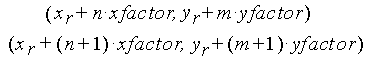

# glPixelZoom function

The **glPixelZoom** function specifies the pixel zoom factors.

## Syntax


```C++
void WINAPI glPixelZoom(
   GLfloat xfactor,
   GLfloat yfactor
);
```


## Parameters

<dl> <dt>

*xfactor* 
</dt> <dd>

The *x* zoom factor for pixel write operations.

</dd> <dt>

*yfactor* 
</dt> <dd>

The *y* zoom factor for pixel write operations.

</dd> </dl>

## Return value

This function does not return a value.

## Error codes

The following error code can be retrieved by the [**glGetError**](glgeterror.md) function.


| Name                                                                                                  | Meaning                                                                                                                               |
|-------------------------------------------------------------------------------------------------------|---------------------------------------------------------------------------------------------------------------------------------------|
| <dl> <dt>**GL\_INVALID\_OPERATION**</dt> </dl> | The function was called between a call to [**glBegin**](glbegin.md) and the corresponding call to [**glEnd**](glend.md).<br/> |


## Remarks

The **glPixelZoom** function specifies values for the *x* and *y* zoom factors. During the execution of [**glDrawPixels**](gldrawpixels.md) or [**glCopyPixels**](glcopypixels.md), if (*x*<sub>r</sub> ,*y*<sub>r</sub> ) is the current raster position, and a given element is in the *n*th row and *m*th column of the pixel rectangle, then pixels whose centers are in the rectangle with corners at



are candidates for replacement. Any pixel whose center lies on the bottom or left edge of this rectangular region is also modified.

Pixel zoom factors are not limited to positive values. Negative zoom factors reflect the resulting image about the current raster position.

The following functions retrieve information related to **glPixelZoom**:

[**glGet**](glgetbooleanv--glgetdoublev--glgetfloatv--glgetintegerv.md) with argument GL\_ZOOM\_X

**glGet** with argument GL\_ZOOM\_Y

## Requirements


| Requirement | Value |
|-------------------------------------|-----------------------------------------------------------------------------------------|
| Minimum supported client<br/> | Windows 2000 Professional \[desktop apps only\]<br/>                              |
| Minimum supported server<br/> | Windows 2000 Server \[desktop apps only\]<br/>                                    |
| Header<br/>                   | <dl> <dt>Gl.h</dt> </dl>         |
| Library<br/>                  | <dl> <dt>Opengl32.lib</dt> </dl> |
| DLL<br/>                      | <dl> <dt>Opengl32.dll</dt> </dl> |


## See also

<dl> <dt>

[**glBegin**](glbegin.md)
</dt> <dt>

[**glCopyPixels**](glcopypixels.md)
</dt> <dt>

[**glDrawPixels**](gldrawpixels.md)
</dt> <dt>

[**glEnd**](glend.md)
</dt> </dl>

 

 


