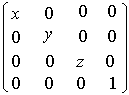

# glScaled function

The **glScaled** and [**glScalef**](glscalef.md) functions multiply the current matrix by a general scaling matrix.

## Syntax


```C++
void WINAPI glScaled(
   GLdouble x,
   GLdouble y,
   GLdouble z
);
```


## Parameters

<dl> <dt>

*x* 
</dt> <dd>

Scale factors along the *x* axis.

</dd> <dt>

*y* 
</dt> <dd>

Scale factors along the *y* axis.

</dd> <dt>

*z* 
</dt> <dd>

Scale factors along the *z* axis.

</dd> </dl>

## Return value

This function does not return a value.

## Error codes

The following error code can be retrieved by the [**glGetError**](glgeterror.md) function.


| Name                                                                                                  | Meaning                                                                                                                               |
|-------------------------------------------------------------------------------------------------------|---------------------------------------------------------------------------------------------------------------------------------------|
| <dl> <dt>**GL\_INVALID\_OPERATION**</dt> </dl> | The function was called between a call to [**glBegin**](glbegin.md) and the corresponding call to [**glEnd**](glend.md).<br/> |


## Remarks

The **glScaled** function produces a general scaling along the *x*, *y*, and *z* axes. The three arguments indicate the desired scale factors along each of the three axes. The resulting matrix is



The current matrix (see [**glMatrixMode**](glmatrixmode.md)) is multiplied by this scale matrix, with the product replacing the current matrix. That is, if M is the current matrix and S is the scale matrix, then M is replaced with M   S.

If the matrix mode is either GL\_MODELVIEW or GL\_PROJECTION, all objects drawn after **glScaled** is called are scaled. Use [**glPushMatrix**](glpushmatrix.md) and [**glPopMatrix**](glpopmatrix.md) to save and restore the unscaled coordinate system.

If scale factors other than 1.0 are applied to the modelview matrix and lighting is enabled, automatic normalization of normals should probably also be enabled ([**glEnable**](glenable.md) and [**glDisable**](gldisable.md) with argument GL\_NORMALIZE).

The following functions retrieve information related to **glScaled**:

[**glGet**](glgetbooleanv--glgetdoublev--glgetfloatv--glgetintegerv.md) with argument GL\_MATRIX\_MODE

[**glGet**](glgetbooleanv--glgetdoublev--glgetfloatv--glgetintegerv.md) with argument GL\_MODELVIEW\_MATRIX

[**glGet**](glgetbooleanv--glgetdoublev--glgetfloatv--glgetintegerv.md) with argument GL\_PROJECTION\_MATRIX

[**glGet**](glgetbooleanv--glgetdoublev--glgetfloatv--glgetintegerv.md) with argument GL\_TEXTURE\_MATRIX

## Requirements


| Requirement | Value |
|-------------------------------------|-----------------------------------------------------------------------------------------|
| Minimum supported client<br/> | Windows 2000 Professional \[desktop apps only\]<br/>                              |
| Minimum supported server<br/> | Windows 2000 Server \[desktop apps only\]<br/>                                    |
| Header<br/>                   | <dl> <dt>Gl.h</dt> </dl>         |
| Library<br/>                  | <dl> <dt>Opengl32.lib</dt> </dl> |
| DLL<br/>                      | <dl> <dt>Opengl32.dll</dt> </dl> |


## See also

<dl> <dt>

[**glBegin**](glbegin.md)
</dt> <dt>

[**glEnd**](glend.md)
</dt> <dt>

[**glMatrixMode**](glmatrixmode.md)
</dt> <dt>

[**glMultMatrix**](glmultmatrix.md)
</dt> <dt>

[**glPopMatrix**](glpopmatrix.md)
</dt> <dt>

[**glPushMatrix**](glpushmatrix.md)
</dt> <dt>

[**glRotated**](glrotated.md)
</dt> <dt>

[**glRotatef**](glrotatef.md)
</dt> <dt>

[**glTranslate**](gltranslate.md)
</dt> </dl>

 

 


