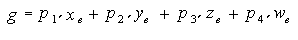
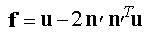
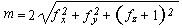
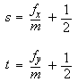

# glTexGenfv function

Controls the generation of texture coordinates.

## Syntax


```C++
void WINAPI glTexGenfv(
         GLenum  coord,
         GLenum  pname,
   const GLfloat *params
);
```


## Parameters

<dl> <dt>

*coord* 
</dt> <dd>

A texture coordinate. Must be one of the following: GL\_S, GL\_T, GL\_R, or GL\_Q.

</dd> <dt>

**pname** 
</dt> <dd>

The symbolic name of the texture coordinate generation function.

</dd> <dt>

*params* 
</dt> <dd>

An array of floats that contains the coefficients for the corresponding texture generation function.

``` syntax
GLfloat zPlane[] = { 0.0f, 0.0f, 1.0f, 0.0f };
```

</dd> </dl>

## Return value

This function does not return a value.

## Error codes

The following error codes can be retrieved by the [**glGetError**](glgeterror.md) function.


| Name                                                                                                  | Meaning                                                                                                                                                |
|-------------------------------------------------------------------------------------------------------|--------------------------------------------------------------------------------------------------------------------------------------------------------|
| <dl> <dt>**GL\_INVALID\_ENUM**</dt> </dl>      | *coord* or *pname* was not an accepted defined value, or *pname* was GL\_TEXTURE\_GEN\_MODE and *params* was not an accepted defined value.<br/> |
| <dl> <dt>**GL\_INVALID\_OPERATION**</dt> </dl> | The function was called between a call to [**glBegin**](glbegin.md) and the corresponding call to [**glEnd**](glend.md). <br/>                 |


## Remarks

The **glTexGen** function selects a texture-coordinate generation function or supplies coefficients for one of the functions. The *coord* parameter names one of the (s,t,r,q) texture coordinates, and it must be one of these symbols: GL\_S, GL\_T, GL\_R, or GL\_Q. The *pname* parameter must be one of three symbolic constants: GL\_TEXTURE\_GEN\_MODE, GL\_OBJECT\_PLANE, or GL\_EYE\_PLANE. If *pname* is either GL\_OBJECT\_PLANE or GL\_EYE\_PLANE, *param* contains coefficients for the corresponding texture generation function.

If the texture generation function is GL\_OBJECT\_LINEAR, the function

![Equation showing the glTexGen function when the texture generation function is GL_OBJECT_LINEAR.]

is used, where g is the value computed for the coordinate named in coord; p1, p2, p3, and p4 are the four values supplied in params; and x?, y?, z?, and w? are the object coordinates of the vertex. You can use this function to texture-map terrain by using sea level as a reference plane (defined by p1, p2, p3, and p4). The GL\_OBJECT\_LINEAR coordinate generation function computes the altitude of a terrain vertex as its distance from sea level; that altitude is used to index the texture image to map white snow onto peaks and green grass onto foothills, for example.

If the texture generation function is GL\_EYE\_LINEAR, the function

![Equation showing the glTexGen function when the texture generation function is GL_EYE_LINEAR.]

is used, where



and x?, y?, z?, and w? are the eye coordinates of the vertex, p1, p2, p3, and p4 are the values supplied in *param*, and M is the modelview matrix when you call **glTexGen**. If M is poorly conditioned or singular, texture coordinates generated by the resulting function can be inaccurate or undefined.

Note that the values in *param* define a reference plane in eye coordinates. The modelview matrix that is applied to them may not be the same one in effect when the polygon vertices are transformed. This function establishes a field of texture coordinates that can produce dynamic contour lines on moving objects.

If *pname* is GL\_SPHERE\_MAP and *coord* is either GL\_S or GL\_T, s and t texture coordinates are generated as follows. Let u be the unit vector pointing from the origin to the polygon vertex (in eye coordinates). Let n  be the current normal, after transformation to eye coordinates. Let f = (fx ( ) fy ( ) fz)T be the reflection vector such that



Finally, let



Then the values assigned to the i and t texture coordinates are



You can enable or disable a texture-coordinate generation function by using [**glEnable**](glenable.md) or [**glDisable**](gldisable.md) with one of the symbolic texture-coordinate names (GL\_TEXTURE\_GEN\_S, GL\_TEXTURE\_GEN\_T, GL\_TEXTURE\_GEN\_R, or GL\_TEXTURE\_GEN\_Q) as the argument. When this function is enabled, the specified texture coordinate is computed according to the generating function associated with that coordinate. When this function is disabled, subsequent vertices take the specified texture coordinate from the current set of texture coordinates. Initially, all texture generation functions are set to GL\_EYE\_LINEAR and are disabled. Both s plane equations are (1,0,0,0); both t plane equations are (0,1,0,0); and all r and q plane equations are (0,0,0,0).

The following functions retrieve information related to glTexGen:

<dl>

[**glGetTexGen**](glgettexgen.md)  
[**glIsEnabled**](glisenabled.md) with argument GL\_TEXTURE\_GEN\_S  
[**glIsEnabled**](glisenabled.md) with argument GL\_TEXTURE\_GEN\_T  
[**glIsEnabled**](glisenabled.md) with argument GL\_TEXTURE\_GEN\_R  
[**glIsEnabled**](glisenabled.md) with argument GL\_TEXTURE\_GEN\_Q  
</dl>

## Requirements


| Requirement | Value |
|-------------------------------------|-----------------------------------------------------------------------------------------|
| Minimum supported client<br/> | Windows 2000 Professional \[desktop apps only\]<br/>                              |
| Minimum supported server<br/> | Windows 2000 Server \[desktop apps only\]<br/>                                    |
| Header<br/>                   | <dl> <dt>Gl.h</dt> </dl>         |
| Library<br/>                  | <dl> <dt>Opengl32.lib</dt> </dl> |
| DLL<br/>                      | <dl> <dt>Opengl32.dll</dt> </dl> |


## See also

<dl> <dt>

[**glBegin**](glbegin.md)
</dt> <dt>

[**glEnd**](glend.md)
</dt> <dt>

[**glCopyTexImage2D**](glcopyteximage2d.md)
</dt> <dt>

[**glCopyTexSubImage2D**](glcopytexsubimage2d.md)
</dt> <dt>

[**glGetTexGen**](glgettexgen.md)
</dt> <dt>

[**glIsEnabled**](glisenabled.md)
</dt> <dt>

[glTexEnv](gltexenv-functions.md)
</dt> <dt>

[**glTexImage1D**](glteximage1d.md)
</dt> <dt>

[glTexParameter](gltexparameter-functions.md)
</dt> <dt>

[**glTexSubImage1D**](gltexsubimage1d.md)
</dt> <dt>

[**glTexSubImage2D**](gltexsubimage2d.md)
</dt> </dl>

 

 


