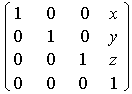

# glTranslatef function

The [**glTranslatef**](gltranslate.md) function multiplies the current matrix by a translation matrix.

## Syntax


```C++
void WINAPI glTranslatef(
   GLfloat x,
   GLfloat y,
   GLfloat z
);
```


## Parameters

<dl> <dt>

*x* 
</dt> <dd>

The *x* coordinate of a translation vector.

</dd> <dt>

*y* 
</dt> <dd>

The *y* coordinate of a translation vector.

</dd> <dt>

*z* 
</dt> <dd>

The *z* coordinate of a translation vector.

</dd> </dl>

## Return value

This function does not return a value.

## Remarks

The **glTranslatef** function produces the translation specified by (*x*, *y*, *z*). The translation vector is used to compute a 4x4 translation matrix:



The current matrix (see [**glMatrixMode**](glmatrixmode.md)) is multiplied by this translation matrix, with the product replacing the current matrix. That is, if M is the current matrix and T is the translation matrix, then M is replaced with M T.

If the matrix mode is either GL\_MODELVIEW or GL\_PROJECTION, all objects drawn after **glTranslatef** is called are translated. Use [**glPushMatrix**](glpushmatrix.md) and **glPopMatrix** to save and restore the untranslated coordinate system.

The following functions retrieve information related to [**glTranslated**](gltranslate.md) and **glTranslatef**:

[**glGet**](glgetbooleanv--glgetdoublev--glgetfloatv--glgetintegerv.md) with argument GL\_MATRIX\_MODE

**glGet** with argument GL\_MODELVIEW\_MATRIX

**glGet** with argument GL\_PROJECTION\_MATRIX

**glGet** with argument GL\_TEXTURE\_MATRIX

## Requirements


| Requirement | Value |
|-------------------------------------|-----------------------------------------------------------------------------------------|
| Minimum supported client<br/> | Windows 2000 Professional \[desktop apps only\]<br/>                              |
| Minimum supported server<br/> | Windows 2000 Server \[desktop apps only\]<br/>                                    |
| Header<br/>                   | <dl> <dt>Gl.h</dt> </dl>         |
| Library<br/>                  | <dl> <dt>Opengl32.lib</dt> </dl> |
| DLL<br/>                      | <dl> <dt>Opengl32.dll</dt> </dl> |


## See also

<dl> <dt>

[**glBegin**](glbegin.md)
</dt> <dt>

[**glEnd**](glend.md)
</dt> <dt>

[**glMatrixMode**](glmatrixmode.md)
</dt> <dt>

[**glMultMatrix**](glmultmatrix.md)
</dt> <dt>

[**glPushMatrix**](glpushmatrix.md)
</dt> <dt>

[**glRotate**](glrotate.md)
</dt> <dt>

[**glScale**](glscale.md)
</dt> </dl>

 

 


