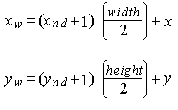

# glViewport function

The **glViewport** function sets the viewport.

## Syntax


```C++
void WINAPI glViewport(
   GLint   x,
   GLint   y,
   GLsizei width,
   GLsizei height
);
```


## Parameters

<dl> <dt>

*x* 
</dt> <dd>

The lower-left corner of the viewport rectangle, in pixels. The default is (0,0).

</dd> <dt>

*y* 
</dt> <dd>

The lower-left corner of the viewport rectangle, in pixels. The default is (0,0).

</dd> <dt>

*width* 
</dt> <dd>

The width of the viewport. When an OpenGL context is first attached to a window, *width* and *height* are set to the dimensions of that window.

</dd> <dt>

*height* 
</dt> <dd>

The height of the viewport. When an OpenGL context is first attached to a window, *width* and *height* are set to the dimensions of that window.

</dd> </dl>

## Return value

This function does not return a value.

## Error codes

The following error codes can be retrieved by the [**glGetError**](glgeterror.md) function.


| Name                                                                                                  | Meaning                                                                                                                               |
|-------------------------------------------------------------------------------------------------------|---------------------------------------------------------------------------------------------------------------------------------------|
| <dl> <dt>**GL\_INVALID\_VALUE**</dt> </dl>     | Either *width* or *height* was negative.<br/>                                                                                   |
| <dl> <dt>**GL\_INVALID\_OPERATION**</dt> </dl> | The function was called between a call to [**glBegin**](glbegin.md) and the corresponding call to [**glEnd**](glend.md).<br/> |


## Remarks

The **glViewport** function specifies the affine transformation of *x* and *y* from normalized device coordinates to window coordinates. Let (*x*<sub>nd</sub> , *y*<sub>nd</sub> ) be normalized device coordinates. The window coordinates (*x*<sub>w</sub> , *y*<sub>w</sub> ) are then computed as follows:



Viewport width and height are silently clamped to a range that depends on the implementation. This range is queried by calling **glGet** with argument GL\_MAX\_VIEWPORT\_DIMS.

The following functions retrieve information related to **glViewport**:

[**glGet**](glgetbooleanv--glgetdoublev--glgetfloatv--glgetintegerv.md) with argument GL\_VIEWPORT

**glGet** with argument GL\_MAX\_VIEWPORT\_DIMS

## Requirements


| Requirement | Value |
|-------------------------------------|-----------------------------------------------------------------------------------------|
| Minimum supported client<br/> | Windows 2000 Professional \[desktop apps only\]<br/>                              |
| Minimum supported server<br/> | Windows 2000 Server \[desktop apps only\]<br/>                                    |
| Header<br/>                   | <dl> <dt>Gl.h</dt> </dl>         |
| Library<br/>                  | <dl> <dt>Opengl32.lib</dt> </dl> |
| DLL<br/>                      | <dl> <dt>Opengl32.dll</dt> </dl> |


## See also

<dl> <dt>

[**glBegin**](glbegin.md)
</dt> <dt>

[**glDepthRange**](gldepthrange.md)
</dt> </dl>

 

 


