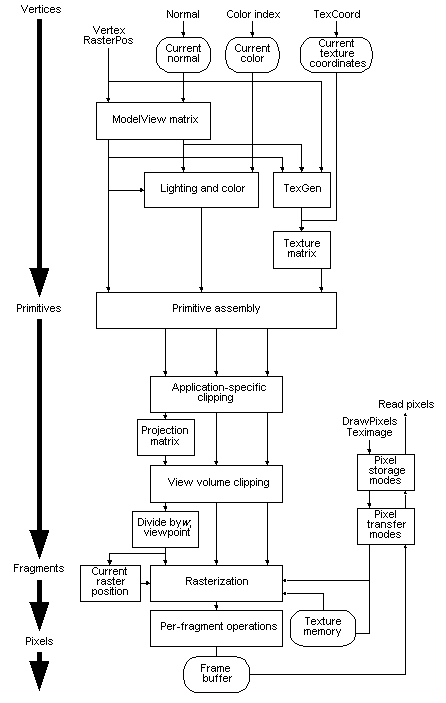

# OpenGL Processing Pipeline

Many OpenGL functions are used specifically for drawing objects such as points, lines, polygons, and bitmaps. Some functions control the way that some of this drawing occurs (such as those that enable antialiasing or texturing). Other functions are specifically concerned with framebuffer manipulation. The topics in this section describe how all of the OpenGL functions work together to create the OpenGL processing pipeline. This section also takes a closer look at the stages in which data is actually processed, and ties these stages to OpenGL functions.

The following diagram details the OpenGL processing pipeline. For most of the pipeline, you can see three vertical arrows between the major stages. These arrows represent vertices and the two primary types of data that can be associated with vertices: color values and texture coordinates. Also note that vertices are assembled into primitives, then into fragments, and finally into pixels in the framebuffer. This progression is discussed in more detail in [Vertices](vertices.md), [Primitives](primitives.md), [Fragments](fragments.md), and [Pixels](pixels.md).

 

 

