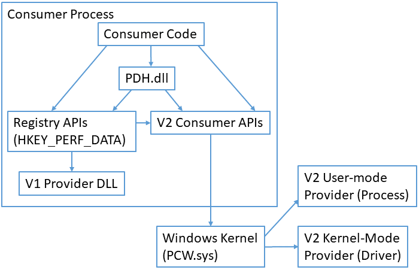

# About Performance Counters

Windows Performance Counters provide a high-level abstraction layer with a consistent interface for collecting various kinds of system data such as processor, memory, and disk usage statistics. System administrators use performance counters to monitor for performance or behavior problems. Software developers use performance counters to inspect the resource usage of their components.

> [!IMPORTANT]
> Windows Performance Counters are optimized for administrative/diagnostic data discovery and collection. They are not appropriate for high-frequency data collection or for application profiling since they are not designed to be collected more than once per second. For lower-overhead access to system information, you might prefer more direct APIs such as [**Process Status Helper**](../psapi/process-status-helper.md), [**GlobalMemoryStatusEx**](/windows/win32/api/sysinfoapi/nf-sysinfoapi-globalmemorystatusex), [**GetSystemTimes**](/windows/win32/api/processthreadsapi/nf-processthreadsapi-getsystemtimes), or [**GetProcessTimes**](/windows/win32/api/processthreadsapi/nf-processthreadsapi-getprocesstimes). For profiling, you might collect ETW logs with system profiling data using [**tracelog.exe**](/windows-hardware/drivers/devtest/tracelog) with `-critsec`, `-dpcisr`, `-eflag`, or `-ProfileSource` options, or you might use [**Hardware Counter Profiling**](/previous-versions/windows/desktop/hcp/hcp-reference).

> [!NOTE]
> Do not confuse Windows Performance Counters with the [**QueryPerformanceCounter**](/windows/win32/api/profileapi/nf-profileapi-queryperformancecounter) API. Windows Performance Counters provide a high-level abstraction for many kinds of system information. The QueryPerformanceCounter function provides optimized access to a high-precision timestamp.

## Getting Started

- Use [Performance Counter Tools](performance-counters-tools.md) when you want to collect or view the performance data from a system.
- Use [Performance Counter Collection APIs](consuming-counter-data.md) when you want to write a script or a program that collects performance data from the local system.
- Use [WMI Performance Counter Classes](/windows/desktop/WmiSdk/monitoring-performance-data) when you want to collect performance data from a local or remote system using WMI.
- Use [Performance Counter Provider APIs](providing-counter-data.md) when you want to publish performance data from your software component.

## Concepts

The Windows Performance Counter system is organized into **consumers**, **providers**, **countersets**, **counters**, **instances**, and **counter values**.

A **consumer** is a software component that makes use of performance data. Windows includes several [built-in tools](performance-counters-tools.md) that make use of performance data. These include Task Manager, Resource Monitor, Performance Monitor, typeperf.exe, logman.exe, and relog.exe. Developers can write scripts and applications that access performance counters via [performance counter APIs](consuming-counter-data.md).

A **provider** is a software component that [generates and publishes performance data](providing-counter-data.md). A provider will publish data for one or more *countersets*. For example, a database system might register itself as a performance data provider.

- A **V1 provider** is a software component that publishes performance data via a [performance DLL](providing-counter-data-using-a-performance-dll.md) that runs in the process of the consumer. A V1 provider is installed onto a system via an `.ini` file. The V1 provider architecture is deprecated. New providers should use the V2 provider architecture.
- A **V2 provider** is a software component that publishes performance data via the [performance counter provider APIs](providing-counter-data-using-version-2-0.md). A V2 provider is installed onto a system via a `.man` (XML manifest) file.

A **counterset** is a grouping of performance data within a provider. A counterset has a name and one or more *counters*. Collecting the data from a counterset returns a number of *instances*. In some Windows APIs, countersets are called **performance objects**. For example, a performance data provider for a database system might provide a counterset for per-database statistics.

A **counter** is the definition of single piece of performance data. A counter has a name and a type. For example, a "per-database statistics" counterset might contain a counter named "transactions per second" with type `PERF_COUNTER_COUNTER`.

An **instance** is an entity about which performance data is reported. An instance has a name (string) and one or more *counter values*. For example, a "per-database statistics" counterset might contain one instance per database. The instance name would be the database name, and each instance would contain counter values for "transactions per second", "memory usage", and "disk usage" counters.

A **counter value** is the value of a single piece of performance counter data. A counter value is an unsigned integer, either 32-bit or 64-bit depending on the type of the corresponding counter. When talking about an *instance*, a *counter value* might sometimes be called a *counter* or a *value*.

> [!TIP]
> It might be helpful to relate performance counter terms to more familiar spreadsheet terms. A **counterset** is like a table. A **counter** is like a column. An **instance** is like a row. A **counter value** is like a cell in the table.

**Single-instance countersets** always contain data for exactly one instance. This is common for countersets that report system-global statistics. For example, Windows has a built-in single-instance counterset named "Memory" that reports on global memory usage.

**Multi-instance countersets** contain data for a variable number of instances. This is common for countersets that report about entities within the system. For example, Windows has a built-in multi-instance counterset named "Processor Information" that reports one instance for each installed CPU.

Consumers will periodically collect and record the data from a provider's counterset. For example, the consumer might collect data once per second or once per minute. The data collected is called a **sample**. A sample consists of timestamps along with the data for instances of the counterset. The data for each instance includes the instance name (string) and a set of counter values (integers, one value for each counter in the counterset).

Instance names should normally be unique within a sample, i.e. a provider should not return two instances with the same name as part of a single sample. Some older providers do not follow this rule, so [consumers must be able to tolerate non-unique instance names](handling-duplicate-instance-names.md). Instance names are not case-sensitive, so instances should not have names that differ only in case.

> [!NOTE]
> For backwards-compatibility reasons, the "Process" counterset returns non-unique instance names based on the EXE filename. This can cause confusing results, especially when a process with a non-unique name starts up or shuts down, as this will typically result in data glitches due to incorrect matching of instance names between samples. Consumers of the "Process" counterset must be able to tolerate these non-unique instance names and the resulting data glitches.

Instance names must be stable across samples, i.e. a provider should use the same instance name for the same entity each time the counterset is collected.

Each counter has a type. The counter type indicates the type of the counter's **raw value** (either unsigned 32-bit integer or unsigned 64-bit integer). The counter type also indicates what the counter's raw value represents, which determines how the raw value should be processed to generate useful statistics.

While some counter types are simple and have a raw value that is directly useful, many counter types require [additional processing](calculating-counter-values.md) to create a useful **formatted value**. To produce the formatted value, some counter types require raw values from two samples, some counter types require timestamps, and some counter types require raw values from multiple counters. For example:

- `PERF_COUNTER_LARGE_RAWCOUNT` is a 64-bit raw value that requires no processing to be useful. It is appropriate for point-in-time values such as "Bytes of memory in use".
- `PERF_COUNTER_RAWCOUNT_HEX` is a 32-bit raw value that requires only simple hexadecimal formatting to be useful. It is appropriate for point-in-time or identifying information such as "Flags" or "Base Address".
- `PERF_COUNTER_BULK_COUNT` is a 64-bit raw value that indicates a count of events and is used to compute the rate at which the events occur. To be useful, this counter type requires two samples that are separated in time. The formatted value is the event rate, i.e. the number of times the event occurred per second over the interval between the two samples. Given two samples `s0` and `s1`, the formatted value (event rate) would be computed as `(s1.EventCount - s0.EventCount)/(s1.TimestampInSeconds - s0.TimestampInSeconds)`.

Providers are expected to behave as if they are stateless, i.e. collecting data from a counterset should not visibly affect the state of the provider. For example, a provider should not reset counter values to 0 when a counterset is collected and it should not use the timestamp of a previous collection to adjust the values in the current collection. Instead, it should provide simple raw counter values with accurate types so that the consumer can compute useful statistics based on the raw values and their timestamps.

## Performance API Architecture

Performance counter consumers include:

- [Microsoft-provided applications](performance-counters-tools.md) such as Task Manager, Resource Monitor, Performance Monitor, and typeperf.exe.
- Microsoft-provided high-level API surfaces that expose performance counter data such as [WMI Performance Classes](/windows/desktop/WmiSdk/monitoring-performance-data).
- Your own applications or scripts that use [performance counter consumer APIs](consuming-counter-data.md).

Most performance counter consumers use APIs from [PDH.dll](using-the-pdh-functions-to-consume-counter-data.md) to collect performance data. PDH manages many complex aspects of gathering performance counters such as parsing queries, matching up instances across multiple samples, and computing formatted values from the raw counter data. The PDH implementation uses the registry APIs when consuming data from a V1 provider and uses the V2 consumer APIs when consuming data from a V2 provider.

Some older performance counter consumers use the [registry APIs](using-the-registry-functions-to-consume-counter-data.md) to collect performance data from the special `HKEY_PERFORMANCE_DATA` registry key. This is not recommended for new code because processing the data from the registry is complex and error-prone. The registry API implementation directly supports collecting data from V1 providers. It indirectly supports collecting data from V2 providers through a translation layer that uses the V2 consumer APIs.

Some performance counter consumers use the [PerfLib V2 Consumer functions](using-the-perflib-functions-to-consume-counter-data.md) to directly access data from V2 providers. This is more complex than consuming data using the PDH APIs, but this approach can be useful if PDH APIs cannot be used due to performance or dependency concerns. The PerfLib V2 implementation directly supports collecting data from V2 providers. It does not support collecting data from V1 providers.

> [!NOTE]
> Windows OneCore does not include PDH.dll and does not include support for consuming performance counter data via the registry APIs. Consumers running on OneCore must use the PerfLib V2 Consumer functions.

V1 providers are implemented as a provider DLL that is loaded into the consumer process. The registry API implementation manages loading the provider DLL, calling into the DLL to collect performance data, and unloading the DLL as appropriate. The provider DLL is responsible for [collecting performance data as appropriate](communicating-with-your-application.md), e.g. by using normal Windows APIs, RPC, named pipes, shared memory, or other interprocess communication mechanisms.

V2 providers are implemented as either a user-mode program (often a Windows service) or a kernel-mode driver. Usually the performance data provider code is integrated directly into an existing component (i.e. the driver or service is reporting statistics about itself). The PerfLib V2 implementation manages requests and responses via the PCW.sys kernel extension so the provider usually does not need to implement any interprocess communication to provide the performance data.

> [!NOTE]
> Windows Performance Counter APIs and tools include limited support for accessing performance counters from other machines via Remote Registry (for V1 providers) and RPC (for V2 providers). This support is often hard to use in terms of authentication controls (the tools and APIs can only authenticate as the current user) as well as in terms of [system configuration](accessing-remote-counter-data.md) (the necessary endpoints and services are disabled by default). In many cases, it is better to access the performance counters of remote systems via [WMI](/windows/desktop/WmiSdk/monitoring-performance-data) rather than via the built-in remote access support.

## Developer audience

Performance counters are often consumed by administrators to identify performance issues or abnormal behavior of systems, by developers to study resource usage of software components, and by individual users to understand how programs are behaving on their system. Usage may occur via GUI tools like Task Manager or Performance Monitor, command-line tools like typeperf.exe or logman.exe, via scripting via WMI and PowerShell, or through C/C++ and .NET APIs.

Performance counter providers are usually implemented as kernel-mode drivers or user-mode services. Performance counter providers are usually written in C or C++.

## Run-time requirements

For information about run-time requirements for a particular programming element, see the Requirements section of the reference page for that element.

For version history, see [What's New](performance-counters-what-s-new.md).

## See also

[Using Performance Counters](using-performance-counters.md)

[Performance Counters Reference](performance-counters-reference.md)
