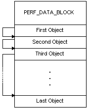
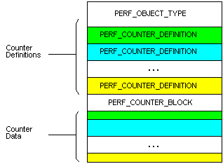
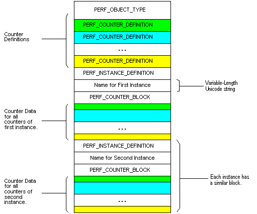

# Performance Data Format

The format of the data retrieved by the [**RegQueryValueEx**](/windows/desktop/api/winreg/nf-winreg-regqueryvalueexa) function begins with a fixed-length header structure, [**PERF\_DATA\_BLOCK**](/windows/desktop/api/Winperf/ns-winperf-perf_data_block). The **PERF\_DATA\_BLOCK** structure describes the system and the performance data. The **PERF\_DATA\_BLOCK** structure is followed by variable number of variable-length object data items. The header of each object item contains the offset of the next object item in the list. The following diagram shows the basic performance data structure.

There are two formats for the object data items: one that supports multiple instances, and the other that does not support multiple instances.

Each object data item block contains a [**PERF\_OBJECT\_TYPE**](/windows/desktop/api/Winperf/ns-winperf-perf_object_type) structure, which describes the performance data for the object. The **PERF\_OBJECT\_TYPE** structure is followed by a list of [**PERF\_COUNTER\_DEFINITION**](/windows/desktop/api/Winperf/ns-winperf-perf_counter_definition) structures, one for each counter defined for the object. For an object with only one instance, the list of **PERF\_COUNTER\_DEFINITION** structures is followed by a single [**PERF\_COUNTER\_BLOCK**](/windows/desktop/api/Winperf/ns-winperf-perf_counter_block) structure, followed by the counter data. Each **PERF\_COUNTER\_DEFINITION** structure contains the offset from the start of the **PERF\_COUNTER\_BLOCK** structure to the corresponding counter data. The following diagram shows the structure of a performance object that does not support multiple instances.

For an object type that supports multiple instances, the list of [**PERF\_COUNTER\_DEFINITION**](/windows/desktop/api/Winperf/ns-winperf-perf_counter_definition) structures is followed by a list of instance information blocks (one for each instance). Each instance information block contains a [**PERF\_INSTANCE\_DEFINITION**](/windows/desktop/api/Winperf/ns-winperf-perf_instance_definition) structure, the name of the instance, and a [**PERF\_COUNTER\_BLOCK**](/windows/desktop/api/Winperf/ns-winperf-perf_counter_block) structure. The following diagram shows the structure of a performance object that supports two instances.

For an example that uses the offsets, see [Displaying Object, Instance, and Counter Names](displaying-object-instance-and-counter-names.md).

 

 
