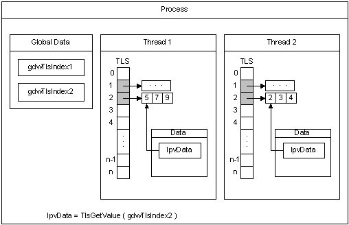

# Thread Local Storage

All threads of a process share its virtual address space. The local variables of a function are unique to each thread that runs the function. However, the static and global variables are shared by all threads in the process. With *thread local storage* (TLS), you can provide unique data for each thread that the process can access using a global index. One thread allocates the index, which can be used by the other threads to retrieve the unique data associated with the index.

The constant TLS\_MINIMUM\_AVAILABLE defines the minimum number of TLS indexes available in each process. This minimum is guaranteed to be at least 64 for all systems. The maximum number of indexes per process is 1,088.

When the threads are created, the system allocates an array of **LPVOID** values for TLS, which are initialized to NULL. Before an index can be used, it must be allocated by one of the threads. Each thread stores its data for a TLS index in a *TLS slot* in the array. If the data associated with an index will fit in an **LPVOID** value, you can store the data directly in the TLS slot. However, if you are using a large number of indexes in this way, it is better to allocate separate storage, consolidate the data, and minimize the number of TLS slots in use.

The following diagram illustrates how TLS works. For a code example illustrating the use of thread local storage, see [Using Thread Local Storage](using-thread-local-storage.md).

The process has two threads, Thread 1 and Thread 2. It allocates two indexes for use with TLS, gdwTlsIndex1 and gdwTlsIndex2. Each thread allocates two memory blocks (one for each index) in which to store the data, and stores the pointers to these memory blocks in the corresponding TLS slots. To access the data associated with an index, the thread retrieves the pointer to the memory block from the TLS slot and stores it in the lpvData local variable.

It is ideal to use TLS in a dynamic-link library (DLL). For an example, see [Using Thread Local Storage in a Dynamic Link Library](../dlls/using-thread-local-storage-in-a-dynamic-link-library.md).

## Related topics

<dl> <dt>

[Thread Local Storage (Visual C++)](/cpp/parallel/thread-local-storage-tls?view=vs-2019)
</dt> <dt>

[Using Thread Local Storage](using-thread-local-storage.md)
</dt> <dt>

[Using Thread Local Storage in a Dynamic Link Library](../dlls/using-thread-local-storage-in-a-dynamic-link-library.md)
</dt> </dl>

 

 
