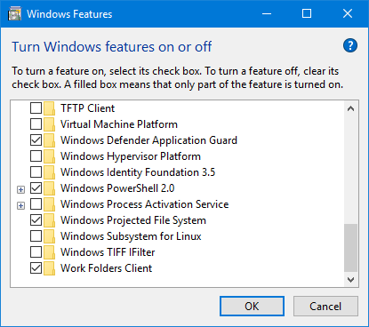

# Enabling Windows Projected File System

ProjFS ships with Windows as an Optional Component.  Before a provider can use it, it must be enabled.  You can use <!--the GUI or--> PowerShell to enable ProjFS.

<!--
## How to enable ProjFS in the GUI

Open the Start menu and type "Control Panel".  Click "Programs", then "Turn Windows features on or off".  In the Windows Features dialog box select the check box next to "Windows Projected File System":


-->

## How to enable ProjFS using PowerShell

To use PowerShell to enable ProjFS use the `Enable-WindowsOptionalFeature` cmdlet in an elevated PowerShell window:

```PowerShell
Enable-WindowsOptionalFeature -Online -FeatureName Client-ProjFS -NoRestart
```

Reboot the computer if the Enable-WindowsOptionalFeature reports `RestartNeeded: True`.
