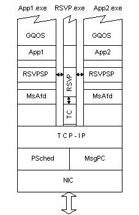

# How Windows 2000 QOS Works

To achieve manageable and predictable quality of service from one end of the network to the other, the collection of components that must communicate and interact results in a fairly complex process. Quality of Service has the ability to facilitate priority every step of the way: in the sender's network stack, at the switch, and even at each QOS-enabled router hop.

QOS also has the ability to facilitate how much data can and should be sent in a given unit of time, maximum burst rates, and overall bandwidth utilization rights. These can be configured based on administrative policies. These functional capabilities only scratch the surface of quality of service.

QOS is comprised of a number of components. The following figure shows where many of the QOS components reside in relation to the network stack, where communication occurs between and among them, and where certain interfaces, such as APIs, facilitate developing QOS services.

Note that this is an individual node's network stack view, not a functional schematic of how quality of service operates over a given network. Some of these components have further defined subcomponents, which are explained under [Components](qos-components.md).

 

 

