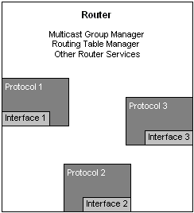
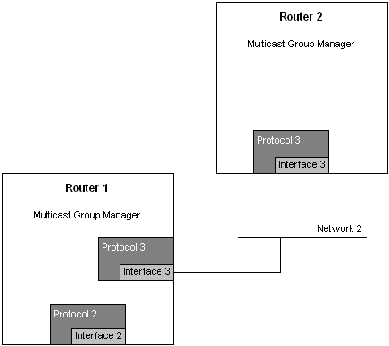
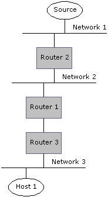

# How the Multicast Architecture Fits Together

This section describes a sample configuration and how the major components fit together.

The following illustration shows the relationship between the various components of a router.

The multicast group manager is a part of the RRAS service that runs on a server that is operating as a router.

The router shown has three multicast routing protocols (Protocol 1, Protocol 2, Protocol 3) running on it. Each protocol can own one or more interfaces (in this illustration, Protocol 1 owns Interface 1, Protocol 2 owns Interface 2, and Protocol 3 owns Interface 3). Each interface can be owned by only one routing protocol (in addition to IGMP, which is a special case).

The multicast group manager runs on the router and coordinates the distribution of group information between the routing protocols.

The following illustration shows the relationship between two routers in a multicast architecture.

In the previous illustration, Router 2 sends a multicast message to Network 2 on Interface 3. Router 1 receives the multicast message from Network 2 on Interface 3. On both routers, Protocol 3 owns the respective Interface 3.

The following illustration shows the path a message from a multicast source (to a multicast group) takes to reach the host that has joined the multicast group. The routers in the illustration use the same configuration as previous illustrations; however, the interface and protocol details are not shown in order to keep the figure simple.

The following scenario describes the events that take place when a host joins a multicast group. Refer to the previous illustration for relationships between the various entities.

1.  Host 1 joins the multicast group G on Network 3.
2.  Router 3 learns about G via IGMP.
3.  The multicast group manager on Router 3 notifies Protocol 3 on Router 3 that there are new receivers for G.
4.  Protocol 3 on Router 3 then notifies Protocol 3 on Router 1 about G.
5.  In turn, Protocol 3 on Router 1 notifies the multicast group manager on Router 1 about G.
6.  The multicast group manager on Router 1 then notifies Protocol 1 and Protocol 2 about G.
7.  Protocol 2 may inform Router 2 about G, if the protocol is designed to do so.

The following scenario describes the events that take place when a message is sent to a multicast group. Refer to the previous illustration for the relationships between the various entities.

1.  A source on Network 1 sends a message to Group G.
2.  The message sent from Source S goes first to Router 2, which then forwards it to Router 1 using Interface 2 (since Router 2 has been informed by Protocol 2 that receivers are present downstream).
3.  Router 1 forwards the message to Router 3 (since Router 1 has been informed by Protocol 2 that receivers are present downstream).
4.  Router 3 forwards the message to Network 3, and therefore it arrives at Host 1.

For further information on multicast routing protocol interaction, see [RFC 2715](routing-protocols-request-for-comments.md), Interoperability Rules for Multicast Routing Protocols.

 

 

