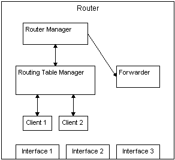
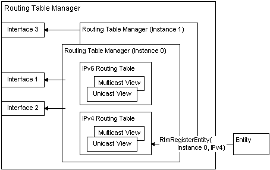
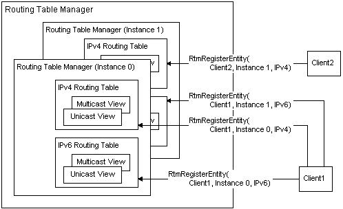
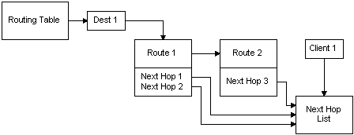

# How the Routing Table Manager Architecture Fits Together

The following illustration shows the relationship between the different components of a router.

When the router is bootstrapped, the router manager service is started, as well as one or more routing protocols. Routing protocols are associated with the various interfaces on the router. The router manager also starts the routing table manager.

The following illustration shows the relationship between clients and the different components of the routing table manager.

The router manager starts one or more instances of the routing table manager. When multiple instances of the routing table manager are started, the router has been configured to act as one or more virtual routers. Each instance of the routing table manager owns one or more interfaces; each interface can only be owned by one instance of the routing table manager.

Each instance of the routing table manager is independent from the others; no information is exchanged between the instances.

Each instance of the routing table manager contains one or more routing tables. Each routing table is associated with an address family.

Each routing table contains one or more views. In this example, the routing table is shown with a unicast and multicast view. Each view is a subset of the routing table.

The following illustration shows the relationship between clients and multiple instances of the routing table manager, routing tables, and views.

An instance of the client can register multiple times with an instance of the routing table manager — once per address family. A client can register with each instance of the routing table manager.

The following illustration shows how the routing table entries are related. For more information on routing table entries, see [Routing Table Entries](routing-table-entries.md).

The routing table contains destinations. Each destination is related to one or more routes. Each route has zero, one, or more pointers to next hops that are associated with the route. Each pointer refers to the actual next hop in the list of next hops. Each client that registers with the routing table manager creates a list of next hops that the client owns.

Routes can only contain pointers to the next-hop list associated with the client that owns the route.

 

 

