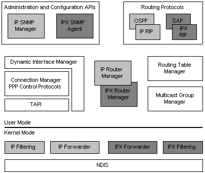

# Routing and Remote Access Services Architecture

The following illustration presents a general architectural view of the Windows 2000 router.

Components that are specific to the IP protocol family are shown in light gray. Components that are specific to the IPX protocol family are shown in dark gray. Components that are general to all protocol families are unshaded.

The Routing and Remote Access Service provides APIs for administering and configuring the service. These APIs include SNMP agents for both IP and IPX.

RRAS includes routing protocols for both IP and IPX. For IP, RRAS provides the Routing Information Protocol (RIP) and Open Shortest Path First (OSPF) routing protocols. For IPX, RRAS provides IPX RIP and Service Advertising Protocol (SAP).

RRAS uses one Routing Table Manager (RTM) for both IP and IPX. However, each protocol family has its own Router Manager. RRAS also has separate component for managing Multicast Groups.

The Dynamic Interface Manager (DIM) interfaces with PPP and TAPI services in order to manage PPP interfaces used by some routes.

 

 

