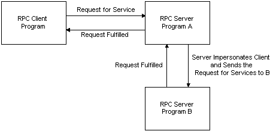

# Client Impersonation

Impersonation is useful in a distributed computing environment when servers must pass client requests to other server processes or to the operating system. In this case, a server impersonates the client's security context. Other server processes can then handle the request as if the original client made it.

For example, a client makes a request to Server A. If Server A must query Server B to complete the request, Server A impersonates the client security context and makes the request to Server B on behalf of the client. Server B uses the original client's security context, instead of the security identity for Server A, to determine whether to complete the task.

The server calls [**RpcImpersonateClient**](/windows/desktop/api/Rpcdce/nf-rpcdce-rpcimpersonateclient) to overwrite the security for the server thread with the client security context. After the task is completed, the server calls [**RpcRevertToSelf**](/windows/desktop/api/Rpcdce/nf-rpcdce-rpcreverttoself) or [**RpcRevertToSelfEx**](/windows/desktop/api/Rpcdce/nf-rpcdce-rpcreverttoselfex) to restore the security context defined for the server thread.

When binding, the client can specify quality-of-service information about security which specifies how the server can impersonate the client. For example, one of the settings lets the client specify that the server is not allowed to impersonate it. For more information, see [Quality of Service](quality-of-service.md).

The capability to call other servers while impersonating the original client is called *delegation*. When delegation is used, a server impersonating a client can call another server, and can make network calls with the credentials of the client. That is, from the perspective of the second server, requests coming from the first server are indistinguishable from requests coming from the client. Not all security providers support delegation. Microsoft ships only one security provider that supports delegation: Kerberos.

Delegation can be a dangerous capability due to the privileges the client gives the server during a remote procedure call. This is why Kerberos allows calls with the impersonation level of delegation only if mutual authentication is requested. Domain administrators can limit the computers to which calls with delegation impersonation level are made to prevent unsuspecting clients from making calls to servers that could abuse their credentials.

One exception to the delegation rule exists: calls using [**ncalrpc**](/windows/desktop/Midl/ncalrpc). When these calls are made the server gets delegation rights, even if an impersonation level of impersonate is specified. That is, a server can call other servers on behalf of the client. This works for one remote call only. For example, if client A calls local server LB using **ncalrpc** local server LB can impersonate and call remote server RB. RB will be able to act on behalf of client A, but only on the remote computer that RB is running on. It cannot make another network call to remote computer C unless LB specified an impersonation level of delegate when it called RB.

> [!Note]  
> The term *impersonation* represents two overlapping meanings. The first meaning of impersonation is the general process of acting on behalf of a client. The second meaning is the specific impersonation level called impersonation. The context of the text generally clarifies the meaning.

 

 

 