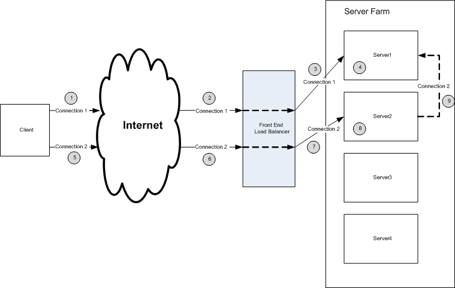

# Deploying Load Balancing

The typical deployment environment and use case is which the RPC Load balancer is utilized is shown below:

1.  The RPC client makes an RPC/HTTP connection to the server farm.
2.  The connection is forwarded through the network to a front end load balancer
3.  The front end load balancer chooses a server to service the request. In this example, the front end load balancer forwards the connection to Server 1.
4.  The RPC Load balancer service arbitrates the connection. It determines that this is the first connection from the client and associates the connection with the local server, Server 1.
5.  The client makes a second RPC/HTTP request.
6.  The request is forwarded through the network to the front end load balancer.
7.  The front end load balancer chooses a server to service the request. In this case, the front end load balancer chooses Server 2 to service the request.
8.  The RPC Load Balancer service arbitrates the connection. It recognizes that connections from this client is being serviced by Server 1.
9.  The connection is forwarded to Server 1.

 

 

