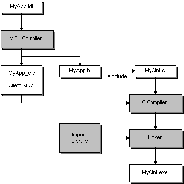

# Developing the Client

Developing an RPC client program is similar to developing the server program. For information on developing an RPC server program, see [Developing the Server](developing-the-server.md).

As in server development, your client program must include the header file that the MIDL compiler generates from your .idl file. The MIDL compiler also generates a C source file containing the client stub. You must compile this C source file and link it to your client program. (In addition, the MIDL compiler generates a C source file containing the server stub, but that is not relevant to this discussion.)

In addition to compiling and linking the client stub with your program files, you must link the import library (and any other libraries your client program needs) to your client program. The process of creating an RPC client program is illustrated in the following diagram.

The example in the preceding illustration demonstrates the creation of an RPC client program called MyClnt.exe. The first step is to define the interface in the file MyApp.idl. The MIDL compiler uses MyApp.idl to generate the file MyApp\_c.c, which contains the client stub. It also generates the file MyApp.h, which the client program must include. The client program will also need to include the files RPC.h and RPCNDR.h.

The client program itself is created in the file MyClnt.c. In a real project, the client program would typically be composed of several C source files. All of them would need to be compiled and linked together. However, this example uses only one file for simplicity.

The files MyClnt.c and MyApp\_c.c are compiled and linked together with the RPC run-time library, and any other libraries that the client program needs. The result is an executable client program named MyClnt.exe.

If you do not compile your IDL file in OSF compatibility mode ([**/osf**](/windows/desktop/Midl/-osf)), your client program must provide a function for allocating memory and a function for deallocating it. For Windows 2000 and later versions, the recommended mode is [**/Oicf**](/windows/desktop/Midl/-oi). For details, see [How Memory Is Allocated and Deallocated](how-memory-is-allocated-and-deallocated.md), and [Pointers and Memory Allocation](pointers-and-memory-allocation.md).

 

 