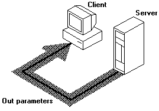

# Directional (Parameter) Attributes

Directional attributes describe whether the data is transmitted from client to server, server to client, or both. All parameters in the function prototype must be associated with directional attributes. The three possible combinations of directional attributes are: 1) \[[**in**](/windows/desktop/Midl/in)\], 2) \[[**out**](/windows/desktop/Midl/out-idl)\], and 3) \[**in**, **out**\]. These describe the way parameters are passed between calling and called procedures. When you compile in the default (Microsoft-extended mode) and you omit a directional attribute for a parameter, the MIDL compiler assumes a default value of \[**in**\].

An \[[**out**](/windows/desktop/Midl/out-idl)\] parameter must be a pointer. In fact, the \[**out**\] attribute is not meaningful when applied to parameters that do not act as pointers because C function parameters are passed by value. In C, the called function receives a private copy of the parameter value; it cannot change the calling function's value for that parameter. If the parameter acts as a pointer, however, it can be used to access and modify memory. The \[**out**\] attribute indicates that the server function should return the value to the client's calling function, and that memory associated with the pointer should be returned in accordance with the attributes assigned to the pointer.

The following interface demonstrates the three possible combinations of directional attributes that can be applied to a parameter. The function **InOutProc** is defined in the IDL file as:

``` syntax
void InOutProc ([in]       short     s1,
                [in, out]  short *  ps2,
                [out]      float *  pf3);
```

The first parameter, *s1*, is \[[**in**](/windows/desktop/Midl/in)\] only. Its value is transmitted to the remote computer, but is not returned to the calling procedure. Although the server application can change its value for *s1*, the value of *s1* on the client is the same before and after the call.

The second parameter, *ps2*, is defined in the function prototype as a pointer with both \[[**in**](/windows/desktop/Midl/in)\] and \[[**out**](/windows/desktop/Midl/out-idl)\] attributes. The \[**in**\] attribute indicates that the value of the parameter is passed from the client to the server. The \[**out**\] attribute indicates that the value pointed to by *ps2* is returned to the client.

The third parameter is \[[**out**](/windows/desktop/Midl/out-idl)\] only. Space is allocated for the parameter on the server, but the value is undefined on entry. As mentioned above, all \[**out**\] parameters must be pointers.

The remote procedure changes the value of all three parameters, but only the new values of the \[[**out**](/windows/desktop/Midl/out-idl)\] and \[[**in**](/windows/desktop/Midl/in)\] parameters are available to the client.


```C++
#define MAX 257

void InOutProc(short    s1,
               short * ps2,
               float * pf3)
{
    *pf3 = (float) s1 / (float) *ps2;
    *ps2 = (short) MAX - s1;
    s1++;  // in only; not changed on the client side
    return;
}
```


On return from the call to **InOutProc**, the second and third parameters are modified. The first parameter, which is \[[**in**](/windows/desktop/Midl/in)\] only, is unchanged.





 

 