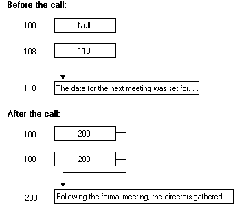

# Full Pointers

Unlike [unique](unique-pointers.md) pointers, full pointers support aliasing. This means that multiple pointers can refer to the same data, as shown in the following figure:



A full pointer has the following characteristics:

-   It can have the value null.
-   It can change from null to non-null during the call. When the value changes to non-null, the client stub allocates new memory allocated on return. The client program should free this memory before it terminates.
-   It can change from non-null to null during the call. When the value changes to null, the application is responsible for freeing the memory.
-   The value can change from one non-null value to another.
-   The storage that a full pointer points to may be accessed by another pointer or name in the operation.
-   Return data is written into existing storage if the pointer does not have the value null.

Use the \[ [**ptr**](/windows/desktop/Midl/ptr) \] attribute to specify a full pointer, as shown in the following example:

``` syntax
/* IDL file */
[ 
  uuid(ba209999-0c6c-11d2-97cf-00c04f8eea45),
  version(1.0)
]
interface FullPtrInterface
{
  void RemoteFn([in,ptr,string]) char *ptrName1,
                [in,ptr,string]  char *ptrName2);
}
```

In this example the parameters *ptrName1* and *ptrName2* are defined as full pointers to a string. It is possible for both pointers to point to the same memory address containing a single string.

\[**ptr**\] is required when providing aliasing support. However, since it requires the most processing of all the pointers available in RPC, it is not recommended for most applications.

 

 