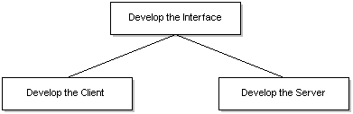

# General Build Procedure

The process for creating a client/server application using Microsoft RPC is:

-   Develop the interface.
-   Develop the server that implements the interface.
-   Develop the client that uses the interface.

The following figure illustrates these steps.

It is feasible and common to develop the client and server applications concurrently. Since both the client and server programs are dependent on the interface, however, the interface between them must be developed before the client and server are developed, as shown in the preceding diagram.

This section discusses the steps required for building a client/server application with RPC. The information is presented in the following topics:

-   [Developing the Interface](developing-the-interface.md)
-   [Developing the Server](developing-the-server.md)
-   [Developing the Client](developing-the-client.md)

 

 

