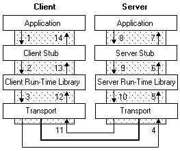

# How RPC Works

The RPC tools make it appear to users as though a client directly calls a procedure located in a remote server program. The client and server each have their own address spaces; that is, each has its own memory resource allocated to data used by the procedure. The following figure illustrates the RPC architecture.

As the illustration shows, the client application calls a local stub procedure instead of the actual code implementing the procedure. Stubs are compiled and linked with the client application. Instead of containing the actual code that implements the remote procedure, the client stub code:

-   Retrieves the required parameters from the client address space.
-   Translates the parameters as needed into a standard NDR format for transmission over the network.
-   Calls functions in the RPC client run-time library to send the request and its parameters to the server.

The server performs the following steps to call the remote procedure.

1.  The server RPC run-time library functions accept the request and call the server stub procedure.
2.  The server stub retrieves the parameters from the network buffer and converts them from the network transmission format to the format the server needs.
3.  The server stub calls the actual procedure on the server.

The remote procedure then runs, possibly generating output parameters and a return value. When the remote procedure is complete, a similar sequence of steps returns the data to the client.

1.  The remote procedure returns its data to the server stub.
2.  The server stub converts output parameters to the format required for transmission over the network and returns them to the RPC run-time library functions.
3.  The server RPC run-time library functions transmit the data on the network to the client computer.

The client completes the process by accepting the data over the network and returning it to the calling function.

1.  The client RPC run-time library receives the remote-procedure return values and returns them to the client stub.
2.  The client stub converts the data from its NDR to the format used by the client computer. The stub writes data into the client memory and returns the result to the calling program on the client.
3.  The calling procedure continues as if the procedure had been called on the same computer.

The run-time libraries are provided in two parts: an import library, which is linked with the application and the RPC run-time library, which is implemented as a dynamic-link library (DLL).

The server application contains calls to the server run-time library functions which register the server's interface and allow the server to accept remote procedure calls. The server application also contains the application-specific remote procedures that are called by the client applications.

 

 

