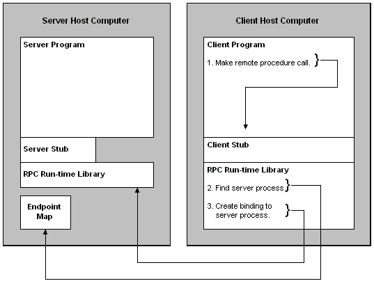

# How the Client Establishes a Connection

To establish a client/server communication session with a server program, client applications with explicit handles need to create a binding handle. After they do, the RPC run-time library finds the computer that hosts the server program. It then finds the endpoint that the server program is listening to and directs the call to it. The following diagram illustrates this process.

This section presents information about how the client connects to the server program and executes remote procedures that it offers. There are many approaches to completing these steps; depending on the design chosen, an application may choose a different set of steps. This example is simply one way of doing so.

The discussion is divided into the following sections:

-   [Creating a Binding Handle](creating-a-binding-handle.md)
-   [Making a Remote Procedure Call](making-a-remote-procedure-call.md)
-   [Finding the Server Program](finding-the-server-program.md)
-   [Sending the Call to the Server Program](sending-the-call-to-the-server-program.md)

 

 

