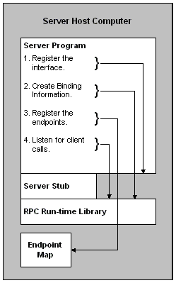

# How the Server Prepares for a Connection

When a server program begins execution, it must first register the interface or interfaces it contains with the RPC run-time library. It then creates the necessary binding information. The server program must also register the endpoint or endpoints it listens to. It can then begin listening for client calls. This process is illustrated in the following diagram.

Depending on the design chosen, a server application may choose a different set of steps; the previous example and illustration provides one approach.

This section presents information on the steps that a server process must take to prepare for a connection. The discussion is divided into the following sections:

-   [Registering the Interface](registering-the-interface.md)
-   [Making the Server Available on the Network](making-the-server-available-on-the-network.md)
-   [Registering Endpoints](registering-endpoints.md)
-   [Listening for Client Calls](listening-for-client-calls.md)

 

 

