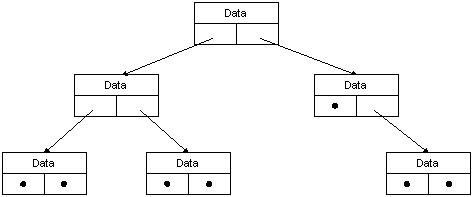

# Introduction to RPC Memory Management

In the context of RPC, memory management involves:

-   Allocating and deallocating the memory needed to simulate a single conceptual address space between the client and the server in the different address spaces of the client and server's threads.
-   Determining which software component is responsible for managing memory — the application or the MIDL-generated stub.
-   Selecting MIDL attributes that affect memory management: directional attributes, pointer attributes, array attributes, and the ACF attributes \[ [byte\_count](/windows/desktop/Midl/byte-count)\], \[ [allocate](/windows/desktop/Midl/allocate)\], and \[ [enable\_allocate](/windows/desktop/Midl/enable-allocate)\].

When a program calls a function or procedure in its address space, memory management is more straightforward than in a distributed application. To illustrate, the following diagram depicts a binary tree. To pass this data structure to a procedure in its address space, a program simply passes a pointer to the root of the tree.

Client/server RPC applications share data across two different memory spaces. These memory spaces may or may not be on the same computer. Either way, the client and server have no direct access to each other's memory space. RPC depends on the ability to simulate the client program's address space in the server program's address space. It must also return data, including new and changed data, from the server to the client memory.

In cases such as the binary tree depicted in the preceding diagram, it is not sufficient to pass a pointer to the root node to a remote procedure. Either the program or the stubs must pass the entire tree to the server's address space for the remote procedure to operate on it.

 

 