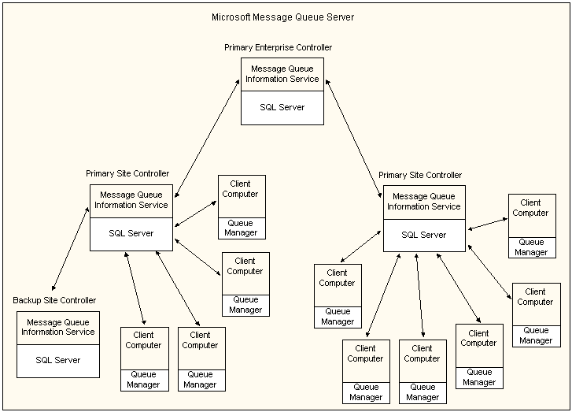

# Overview of Message Queuing Services Architecture

Message Queuing Services (MSMQ) uses a site/enterprise model. Typically, a site is a physical location, such as a building. An enterprise consists of one or more sites and represents an organization.

The following diagram illustrates the architecture of the MSMQ Service.

At the heart of MSMQ is the Message Queue Information Service (MQIS) database, which runs on top of SQL Server. An enterprise has a single master MQIS, called the Primary Enterprise Controller. Each site has its own MQIS, called a *primary site controller* and zero or more *backup site controllers*. Finally, there are the individual client computers, each of which has its own queue manager, implemented as a service. The Primary Enterprise Controller can also be a Primary Site Controller, and any controller can also be a client.

Message queues can be either public or private. Public queues are registered in Active Directory and are accessible across the network. Messages in a public queue are routed throughout the enterprise, under the control of MSMQ. Client application messages move from the client's queue manager to the destination queue by traveling between the queue managers of the site controllers.

Private queues are maintained by the local queue manager and are not registered in Active Directory. The scope of private queue messages is limited to the computer on which they reside.

 

 

