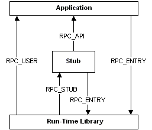

# Portability Macros

The RPC tools achieve model, calling, and naming-convention independence by associating data types and function-return types in the generated stub files and header files with definitions that are specific to each platform. These macro definitions ensure that any data types and functions that require the designation of **\_\_far** are specified as far objects.

The following figure shows the macro definitions that the MIDL compiler applies to function calls between RPC components:

RPC macros are defined as follows.

| Definition    | Description                                                                                                                                         |
|---------------|-----------------------------------------------------------------------------------------------------------------------------------------------------|
| \_\_RPC\_API  | Applied to calls made by the stub to the user application. Both functions are in the same executable program.                                       |
| \_\_RPC\_FAR  | Applied to the standard macro definition for pointers. This macro definition should appear as part of the signature of all user-supplied functions. |
| \_\_RPC\_STUB | Applied to calls made from the run-time library to the stub. These calls can be considered private.                                                 |
| \_\_RPC\_USER | Applied to calls made by the run-time library to the user application. These cross the boundary between a DLL and an application.                   |
| RPC\_ENTRY    | Applied to calls made by the application or stub to the run-time library. This macro definition is applied to all RPC run-time functions.           |

 

To link correctly with the Microsoft RPC run-time libraries, stubs, and support routines, some user-supplied functions must also include these macros in the function definition. Use the macro **\_\_RPC\_API** when you define the functions associated with memory management, user-defined binding handles, and the **transmit\_as** attribute, and use the macro **\_\_RPC\_USER** when you define the context run-down routine associated with the context handle. Specify the functions as:

<dl> <dt>

\_\_RPC\_USER *midl\_user*\_allocate(...)
</dt> <dd></dd> <dt>

\_\_RPC\_USER *midl\_user*\_free(...)
</dt> <dd></dd> <dt>

\_\_RPC\_USER  *handletype*\_bind(...)
</dt> <dd></dd> <dt>

\_\_RPC\_USER *handletype*\_unbind(...)
</dt> <dd></dd> <dt>

\_\_RPC\_USER *type*\_to\_local
</dt> <dd></dd> <dt>

\_\_RPC\_USER *type*\_from\_local
</dt> <dd></dd> <dt>

\_\_RPC\_USER type\_to\_xmit(...)
</dt> <dd></dd> <dt>

\_\_RPC\_USER *type*\_from\_xmit(...)
</dt> <dd></dd> <dt>

\_\_RPC\_USER *type*\_free\_local
</dt> <dd></dd> <dt>

\_\_RPC\_USER *type*\_free\_inst(...)
</dt> <dd></dd> <dt>

\_\_RPC\_USER *type*\_free\_xmit(...)
</dt> <dd></dd> <dt>

\_\_RPC\_USER context\_rundown(...)
</dt> <dd></dd> </dl>

> [!Note]  
> All pointer parameters in these functions must be specified using the macro **\_\_RPC\_FAR**.

 

## Requirements

| Requirement | Value |
|-------------------------------------|----------------------------------------------------------------------------------|
| Minimum supported client  | Windows 2000 Professional \[desktop apps only\]                        |
| Minimum supported server  | Windows 2000 Server \[desktop apps only\]                              |
| Header                    | <dl> <dt>Rpc.h</dt> </dl> |

 

 

